Taiwan is also known under the name "_Formosa_" - Beautiful Island. This is what the Portugese have called this small island when they first passed it in the 16th century, and after 11 days of travelling there I can say that Taiwan is doing its name justice. In this and the next posts I would like to share some experiences, pictures and stories from my travels in this beautiful place.

In summer 2018, I had just finished my first-year exams, and without many other responsibilities, it seemed like it was the perfect opportunity to go on a more 'exotic' trip. It was also the first time that I was travelling completely on my own. Taiwan has convinced me in many ways:

## Why Taiwan?

- **Safety**: Taiwan is considered to be one of the safest countries for travel, at least in terms of its low crime rate. I never felt unsafe, for example when walking alone at night.
- **Language**: Although the Taiwanese use traditional Chinese characters and have their own 'language' - the Fujianese Dialect - most people speak Mandarin. My Chinese is far from proficient, but it suffices for holding daily conversations and asking for directions, so that makes travelling a lot easier.
- **Location**: I had finished an internship in Mainland China (Shanghai) prior to my travels, so I was looking for an accesible region in South-East Asia. Taiwan lies about 180km south-east off the coast of Mainland China, and so can be easily reached by airplane under 2 hours.
- **Landscapes**: Despite being a small island, Taiwan is rich in national parks, mountainous areas and other beautiful landscapes. I was really eager to explore nature and go on longer (day-)hikes, after living in a buzzing metropolis for 2 months, so this was also a huge plus. In fact, I made the National Parks Yangmingshan and Taroko Gorge my main first destinations on my itinerary.

*Hiking in Taroko National Park was definitely one of my highlights*

## Pre-Departure

My main preparation for the trip consisted in browsing through travel blog guides while I was sitting in the office during my internship and had nothing to do lol. In a word doc, I noted down some destinations and attractions that I wanted to go to, but mainly decided what I wanted to do the day before. I had my accommodation for the first few nights booked (in Taipei and Hualian), but did the other nights as I travelled along. Given the typhoon season during which it would rain unexpectedly on certain parts of the island, this allowed for greater flexibility and spontaneity during my travels.

## Getting Around

The transportation network in Taiwan is quite well developed (though more so in the West than in the East), with all the major cities connected through the train network or High-Speed Railway. In Taipei and Kaohsiung, there is also a reliable and affordable metro system, but most other cities rely on their bus transport. I found getting around in Taiwan relatively straightforward, though I can imagine it to be more difficult for foreigners who do not speak Chinese, as most drivers do not speak English very well and signs are also sometimes only in Chinese.

*A shuttle bus in Dakeng Scenic Area, coming only infrequently*

I booked my train tickets from one city to the other mostly one or two days before, and looked up bus schedules on the internet or Google Maps as I went - often I would also find my way by asking around. No major problems encountered whatsoever.

## Food and Drink

The Taiwanese cuisine is similar to what I was used to from China, but each region would also have their own specialties - some popular dishes include a beef noodle soup, fried dumplings and fried seafood.

Taiwan is also a _very_ affordable place for food and drink - one could get a decent and filling meal from 40 - 50 NTD (~1 GBP) upwards. It was possible to find vegetarian options, though one would sometimes have to spend a bit more time looking for them. I occasionally dined in restaurants, but would also just stroll around the many night markets that Taiwanese cities have to offer, and try out different snacks there.

*Shilin Night Market in Taipei*

(Non-alcoholic) Drinks are also huge in Taiwan: Tea shops are around every street corner, selling the famous bubble tea, other tea varieties and soft drinks such as lemonade. People would buy them so frequently that they even bought a multiple- use drink holder as well (so that they don't have to use a plastic bag all the time):

## Itinerary

For travellers, it is common to go clock- or counterclockwise around the island to cover the main sights, as the main cities are all located near the coast ("环岛" is the chinese term for "going around the island"). At first, I thought 11 days are too short to do a roundtour and so planned to only stay in the North, but then I thought: "Nah, who knows when I'll be coming back to Taiwan?" and so also included Taitung and Tainan in the South on my itinerary as well.

I opted to go the clock-wise direction, because I was really eager to see the Taroko National Park in Hualien County in Taiwan's East, so my route ended up being:

Taipei -- Hualian - Dulan/Taitung - Tainan - Taichung - Taipei again.

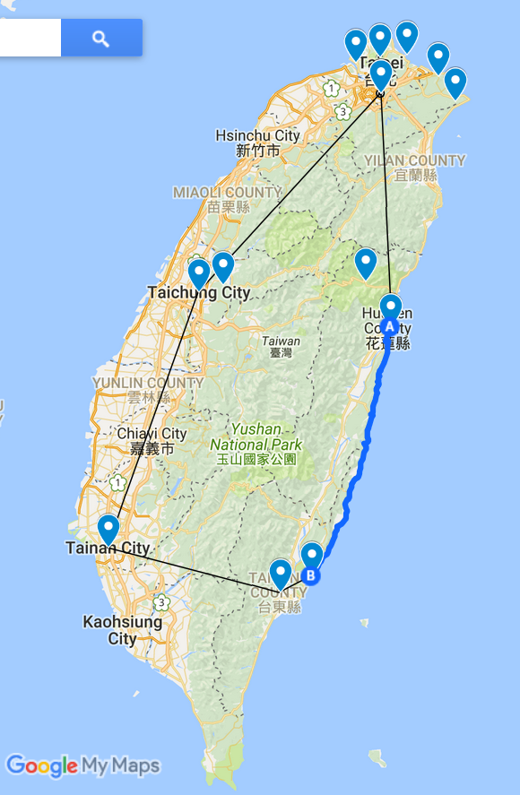

Straight lines I travelled by train, while I travelled the blue curvy line by car, using a hitchhike by friendly Taiwanese locals.

The following pictures capture a few highlights that I had at each stop, for more impressions and detailed account of my time there, I have also written separate posts on each stop.

### 1. [Taipei - Hiking Around the Capital](https://celineliblog.wordpress.com/2018/09/01/taipei-%e5%8f%b0%e5%8c%97-hiking-around-the-capital/)

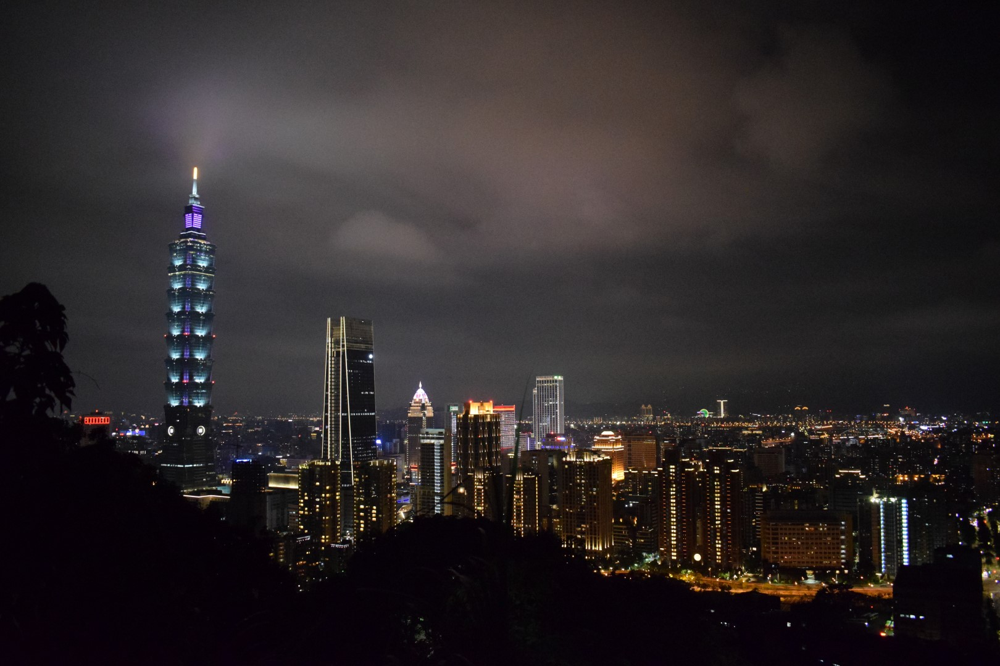
*Elephant Mountain with great skyline view*

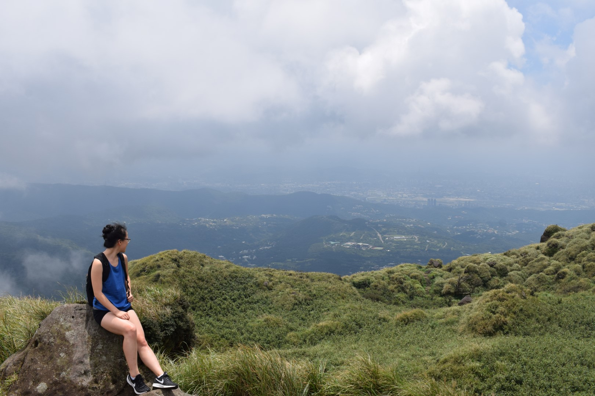
*Yangmingshan National Park - Mount Qixing Peak*

### [2\. Hualian - A Change of Scenery](https://celineliblog.wordpress.com/2018/09/01/hualian-花莲-a-change-of-scenery-on-taiwans-east-coast)

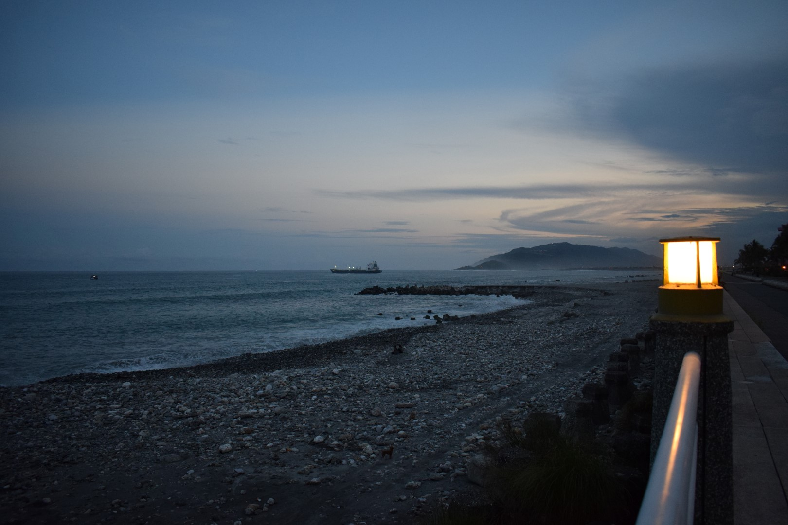
*Hualian City Beach*

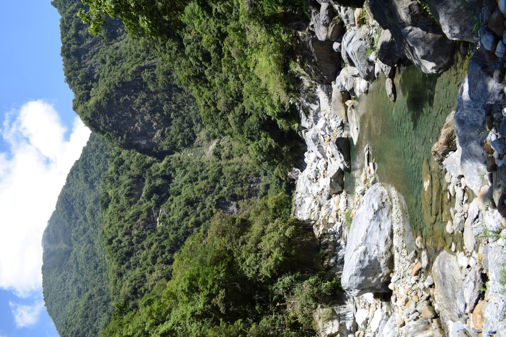
*Taroko National Park*

### [3\. Dulan - Hitchhiking Down Taiwan's East Coast](https://celineliblog.wordpress.com/2018/09/01/dulan-都蘭-hitchhiking-down-taiwans-east-coast)

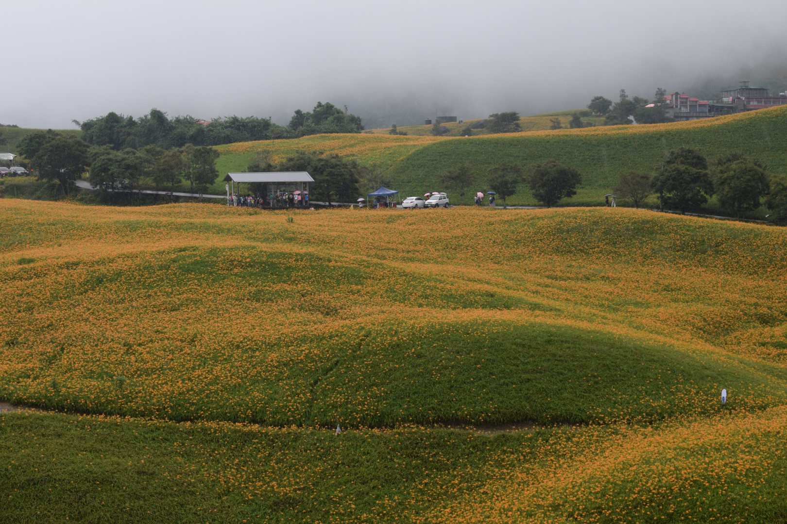
*Hitchhike with a detour, seeing the Daylily Flower Season on a rainy day*

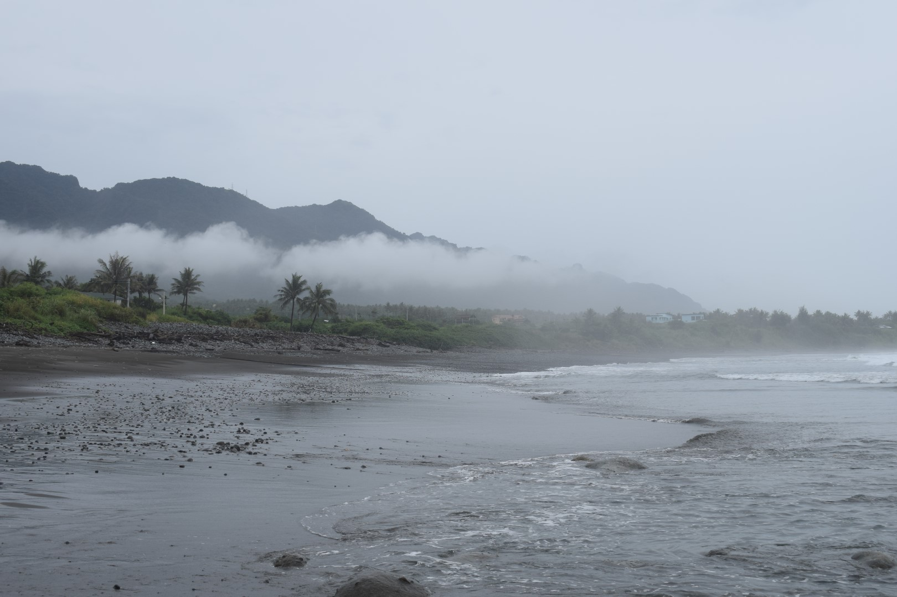
*Black Sand Beach in Dulan*

### [4\. Tainan - The Historic Capital of Taiwan](https://celineliblog.wordpress.com/2018/09/01/tainan-台南-the-historic-capital-of-taiwan)

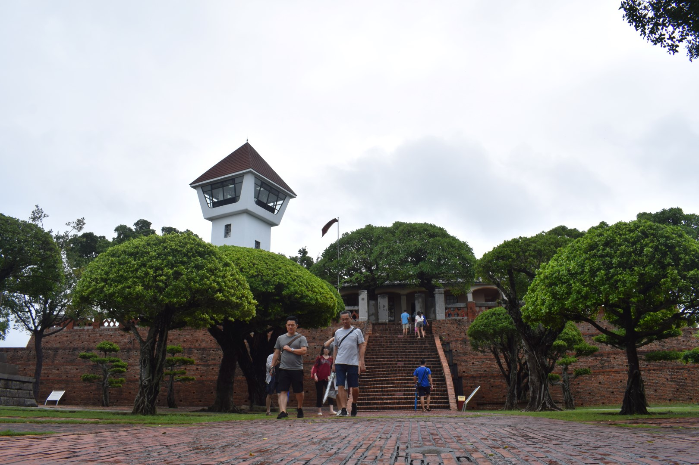
*Ford Zeelandia, former Dutch fortress during the colonization period*

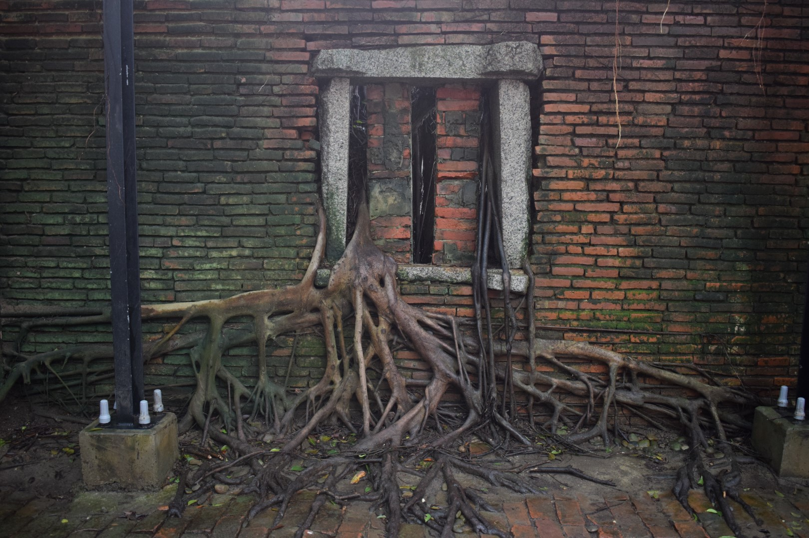
*Anping Tree House*

### [5\. Taichung - A City and its Back Garden](https://celineliblog.wordpress.com/2018/09/01/taichung-台中-a-city-and-its-back-garden)

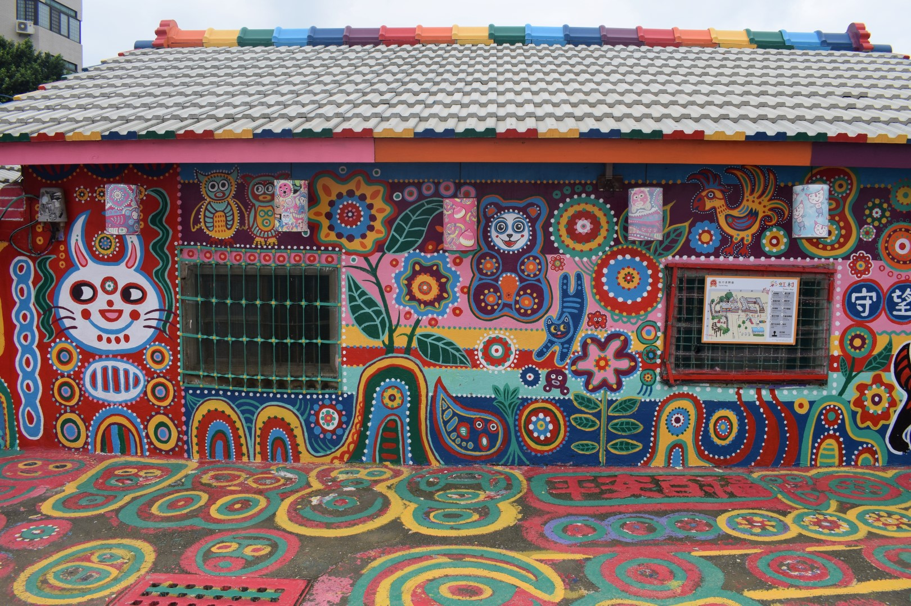
*Rainbow Village*

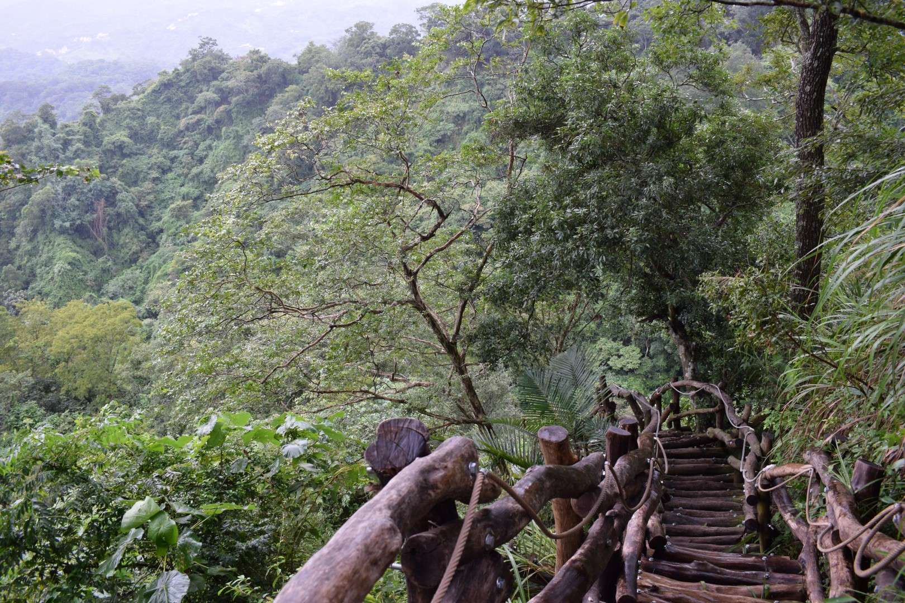
*Dakeng Scenic Area Hiking Trail*

### [6\. Taiwan's North Coast - Beautiful Natural Scenery](https://celineliblog.wordpress.com/2018/09/01/taiwans-north-coast-beautiful-natural-scenery)

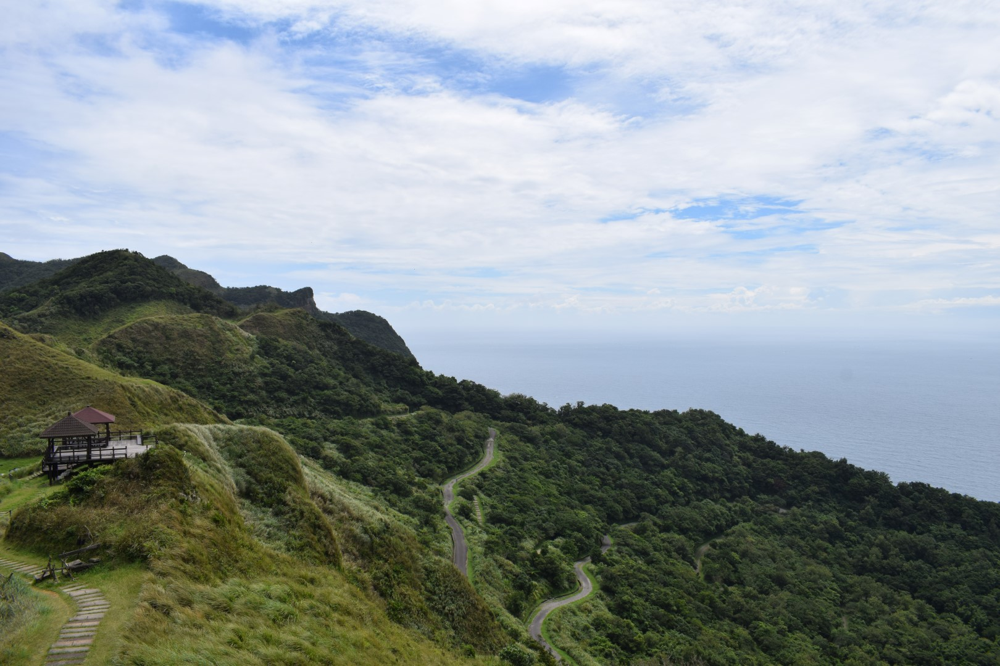
*Caoling Historic Trail*

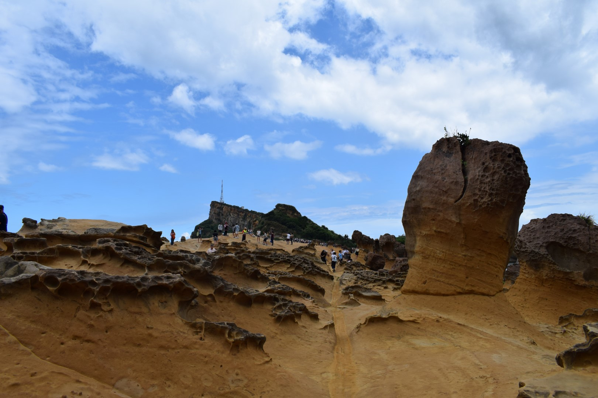
*Yehliu Geopark*

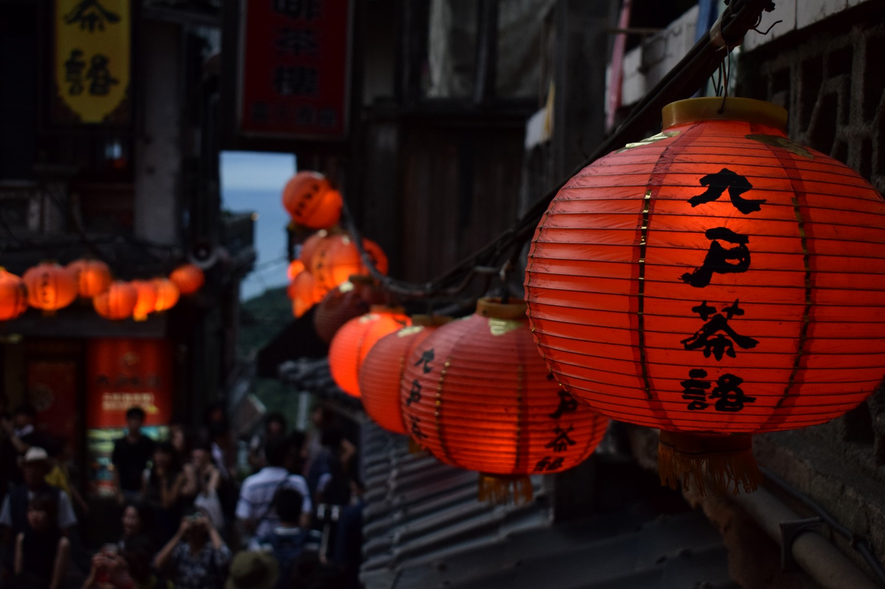
*Jiufen Old Street, the town that inspired the location for "Spirited Away" by Hayao Miyazaki

Overall, I have enjoyed my time in Taiwan very much, since I not only got to see all these amazing landmarks and sights, but also had many interesting encounters with other travellers or Taiwanese locals. The conversations with them often made a deep impression on me and have given me a more authentic experience of the place I was travelling in.

Despite some concerns in the beginning, I have found travelling by myself actually very liberating. It gives you the independence and liberty to do whatever whenever you want, since you do not rely on anyone. But sometimes I guess it would have been nice to share the laughter and memories as well.

There are still a lot of places in Taiwan I did not make it to - so I would definitely like to come back at some point! :)
