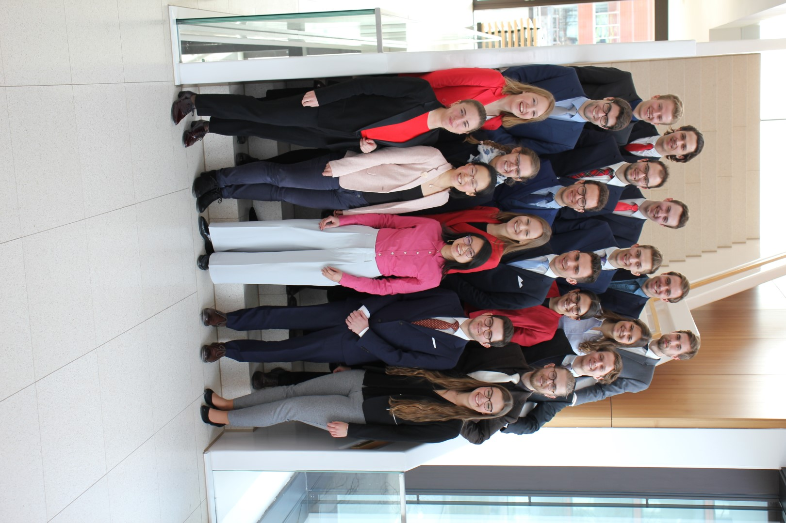

After the first year at university, my start into the second was a bit uneasy. I felt unsure where I wanted to go (academically and otherwise), what I wanted to get out of the  whole "university experience", but at the same time I still had the chronic desire to do it all. It was a mid-degree low for me, and at the centre of my confusion stood the question of which activity I wanted to spend my freetime with. Ideally, it should be stimulating, fun and challenging without being too stressful - but with all those societies and clubs to engage with, people to meet and things to learn and read, how was I ever supposed to pick the "right" thing?

It was during this time that I learned about the 5-month fellowship programme "[be.boosted](http://www.be-boosted.org/)".  I had heard from it through friends who participated in it in previous years, and got interested because what from what they told me, it sounded exactly like the form of challenge I seeked. Writing at the end of the fellowship programme now, I can confidently say that I am so glad I invested my time in this. In what follows, I would like to share my experiences and impressions from "be.boosted", hoping that it might be interesting for some of you, or simply entertaining to read. As a disclaimer, the following is entirely my personal experience and does not represent the "official" view of be.boosted - it should therefore not be taken as representative :) Having said that, let's dive into it!

### What is be.boosted?

With the sub-heading of "shaping future global leaders", this 5-month programme (from November to March) provides online, as well as offline training for a cohort of around 14 young people (students or young professionals) each year. What skills do they train, you ask? Well, all those which, according to be.boosted, are attributes of a good and responsible leader: Effective communication, rhetorical skills, public speaking, negotiation techniques and many more. The training is connected with the debating format of "Model United Nations", because as part of the fellowship, one goes to Harvard World Model United Nations - this year taking place in Madrid!

It sounded too good to me: I had enjoyed learning about rhetorics, public speaking and debating current affairs ever since I participated in a Germany-wide youth debating competition. I am also passionate about meeting inspiring people, from whom I can learn a lot and have interesting discussions with. After a quick check with my timetable (the programme requires to be present on three weekends in Germany, and another week for the World MUN), I just went for it and filled in the application form. After an online interview and a follow up call with one of the trainers, I got the email of confirmation - I was in! And this is how the journey started...

## Offline I - Meeting all the fellows

The 14 participants in the fellowship this year are coming from very diverse backgrounds, and cover a wide variety of different subjects, from medicine over engineering and computer science to economics. We also range quite significantly in age: I am the youngest participant with age 19, while others already have finished their master’s degree and are working on their PhDs now.

There are three "offline" weekends in total throughout the fellowship, as well as weekly online calls. On these weekends, it is where we finally get to be together in person, get to know each other better, receive input from the trainers (and sometimes alumni) and get to advance our skills through exercises and debate.

On the first day, after we had all arrived at the seminar location in Berlin (coming from places all around Germany as well as the UK), the two trainers gave us an introduction into the weekend and more information about the programme in general. They invited us to note down our wishes and expectations for the weekend, and it quickly turned out that we had quite a few! Many expressed their desire to become more aware of the way they speak publicly (in terms of voice and body language) and how to read an audience. Others were more interested into the social side of the programme: To get to know each other well and to grow together as a team. In any case, we were all very much looking forward to what was about to come. Afterwards, we had dinner together in central Berlin, and it was a joy to engage in interesting conversations with my fellow “fellows” over curry and rice at an Indian restaurant.

The second day was filled with input and exercises about using voice and body language in speeches, capturing the attention of an audience, and creative speech writing. One such exercise for example, challenged us to hold an improvised speech, but while holding very unnatural body posture (for example crossed legs, round shoulders, looking down to the ground) – this was entertaining to watch but also quite fruitful in underlining the importance of body posture, since the voice and the content of the speech has immediately been affected by the way we stand.

Our trainers have had much experience with standing in front of a large audience and giving persuasive speeches (coming from debating backgrounds or working as vocal coaches) and were able to communicate the content very well to us. Every time after we had finished an exercise, there would be a round of feedback – from the trainers to the participant but also from fellow to fellow. I realized how invaluable personalized feedback can be: It would highlight the things that I was doing well (e.g. structuring speeches) and then point out areas in which I could improve more (e.g. calming down during speaking and reducing speed). Going through these small exercises really helped to internalize those things and made us conscious about many non-verbal factors relevant to giving good speeches.

On the last day, we got introduced to our first debate in the format of Model United Nations (more on Model United Nations Conference below, under the "London International MUN" heading). Every participant represented one country and we debated on the topic of “Integrating people with disabilities into society”. During the debate, each ‘delegate’ tries to represent their country’s views and bring forward their interests, which they can do through numerous speeches, negotiation and voting. We first had to get used to the various rules of procedure of MUN, but that soon wasn't an issue anymore, which allowed us to focus on the substance of the debate.

## Offline II - "Keep growing: negotiate"

The second offline weekend, taking place in mid-January in Berlin, was all about negotiation. This is a key aspect of the fellowship, and also a handy skill to use when it comes to the Harvard World MUN conference in March in Madrid as well as the London International MUN.

We got introduced into different styles of negotiation - Harvard style and "Never Split the Difference" (based on a book by Chris Voss). Whilst they do share similarities - e.g. they are both about getting to know the other person's interests and making the person you are negotiating with feel valued in their opinions, their approaches differ quite a bit (google the styles if you are interested, it is quite a cool thing to know about). I realized that there is certainly not _one_ single way that always works, but that it is crucial to figure out what suits my 'style' and what is appropriate depending on the situation and negotiation partners. Being authentic is hugley important for for being persuasive.

I remember that at this point, I was already anticipating the coming MUN conferences, and was slightly anxious about it. I felt excited for what was about to come, though I knew that it would most likely to be a very intense and at times also stressful experience (and I would be correct). But luckily, I was not alone in this - Rather, I had a bunch of really amazing and supportive people around me, who provided feedback, advice and hugs whenever I needed them.

## Offline III - It's all about the group

Just 4 weeks later we met again, but this time in Germany's South, in Munich. We were joined by Team London, who will be joining our delegation for the London International Model United Nations conference in February, just two weeks after the third and final offline weekend.

This weekend was not easy for me to make time-wise, as it fell in the midst of my Oxford term, when things start to get busy and work started piling up. I felt like I needed to prepare well for the weekend and get ahead with my work so that I would not fall behind when taking the weekend off. Luckily, that worked out fine and I got to experience an amazing weekend with wonderful people. I was even positively surprised how such an intense 2 day seminar can actually make you leave with more energy than before, instead of making you feel drained.

Especially valuable during the weekend was the experience sharing by alumni - where they answered all the little questions that we had about the fellowship, but especially about the Harvard World MUN conference that was coming up soon in Madrid. It certainly sounds like an intense experience - most of the alumni would say that is was the most stressful week in their lives! Whilst this may not sound like good news, I guess we just have to face the fact that we will need to make the most out of it. And if we can surpass that experience, what else do we have to fear? ;)

As with every Offline weekend, we also had our MUN Mock debate on the Sunday. This time in a larger committee, together with those fellows who made it into the LIMUN fellowship (more on that below). The topic was "Sustainable Growth" and I was representing the Republic of Turkey. It was great fun to debate in a larger committee group, and to engage with a ready draft resolution by using amendments to modify it and make it more suitable to one's country interests.

* * *

## First conference: LONDON INTERNATIONAL MODEL UNITED NATIONS (LIMUN)

On the weekend of the 22nd to 24th February we were finally there: The be.boosted delegation of 2019 would go to an international Model UN conference and apply what we had learnt over the past weeks and months in those many online calls and three offline weekends...

London greeted us with beautiful weather and sunshine:

_**What we did:**_ The whole conference lasted from Friday evening to Sunday afternoon. If you have no idea what MUN is (many of us certainly had never heard of it, let alone done it before coming to LIMUN): It is basically a simulation of various committees which you would find in the actual United Nations, too (there were some exceptions, such as Crisis committees, or a fun committee where delegates represented superheroes). Usually, each delegate represents a country in a committee, and one has to find ways to enhance one's own interests, while also gathering other states' support through forming alliances and the such. I was representing Japan in the Social and Humanitarian Committee (SOCHUM) and our topic was "Ensuring basic rights of expression, assembly and associtation for LGBTQ+ people". During that short, but intense period of time from Friday to Sunday we held debates, had discussions, negotiations, writing sessions for working papers and draft resolutions, amendments for draft resolutions, and finally, we voted for a draft resolution.

_**How I felt:**_ Overall, the LIMUN conference was a very good and valuable experience for me. I experienced all kinds of moods: I felt excited, courageous and happy, but also nervous, disappointed and frustrated. My mood seemed to vary with the various things that happened throughout in the committee.

Naturally throughout the conference, there were quite a few ups and downs. Right in the beginning, I was eager to get started, to debate, to hold speeches and so on. However, I quickly realized, with a committee of about 50 people, speaking time is very limited and naturally one's capacity of influencing the discussion. Before I got the chance to speak, the chair moved to allowing other motions - and so I did not get the chance, like many others, to state my country's position before we moved into the more concrete topics. That was on Friday evening, when I felt a little overwhelmed - I thought: How am I ever going to change anything in this committee? There are just too many people and there is too little I can do!

But this completely changed when we got to the full day on Saturday. As debate progressed, and we started to work on our first working papers, I got the chance to influence the agenda and started to work more closely with other delegates. There were quite a few delegates with whom I got along really well, and so we naturally started working together.

One moment that stood out particularly for me was this: After a while, two main blocs had formed, and for various reasons, we moved back to the General Speaker's list - where one of my allies, Turkey, was in a top position. What she did then was amazing: She passed me a note, saying that she would like to yield her speaking time to me. I was impressed and honoured - what a kind and strategic move! With that heads-up, I had a couple of speeches time to prepare for what I wanted to say... she then stood up when it was her turn, and yielded her complete speaking time to me! It was such a rewarding moment - after the work that we had done together, seeing the trust that she has put in me really warmed my heart :)

The cherry on top were the socials, which included a black tie ball in a fancy location:

#### _**What I learnt - Three main take-aways**_

**Things _don't_ go as you planned them - deal with it.** In these committee situations which are moderated by chairs, there will always be times when things do not go as you wanted them to. For example, the chair might close the General Speaker's list just before it is your turn, a topic that you want to see debated does not motion through, or a merger of different working papers might not work as you see it fit. In these situations, I learned that it is often better to not get frustrated about it, but rather just to go with the flow. If people want to debate something else and there seems to be no way of persuading them otherwise - that's fine. One just needs to look ahead and see how the situation can be handled, without getting upset or frustrated by it.

**It needs to click with the people.** MUN is obviously a role play of the United Nations - so naturally, countries from certain geographics regions, or with similar interests, will find together. But even if your country might be more aligned - policywise - with certain countries than with others, if working together does not work on a personal level with the delegates, then going with the other ones might be the better route. I had the great privilege to find amazing delegates who were really willing to cooperate and we simply clicked on a personal level, so from the start on we were a great team.

**Pushing through is so worth it.** Conference days are long, and after the first few sessions, we all got pretty tired. But in the end, it really paid off to continue being proactive and a driving force in the committee. I found that people really seemed to appreciate the work that I was doing, and that they also _wanted_ to work with me. I learnt that even when things do not go my way, keeping up that damn placard will eventually still pay off :)

Finally, all the work that we had put in even got rewarded, in the form of LIMUN's diplomacy awards. Those are given out by the chairs of each committee, to delegates which they deemed to be excelling at their jobs. Our delegation, being a large one with over 22 delegates, won the "Best Large Delegation Award". This has been an encouraing external recognition, because it means that the values that we stand for, of inclusive and responsible leadership, are echoed in the wider MUN community.

#### _The Next Step_

LIMUN was only the beginning. The ultimate challenge and milestone has been Harvard WorldMUN conference in Madrid. This conference has been longer (5 days instead of 2), more intense because of larger committees and more experienced/ambitious people, and also different in its own way, because we would be together with double delegates, rather than by ourselves.

So only two and a half weeks later following LIMUN, it was finally time for...

## Second conference: HARVARD WORLD MODEL UNITED NATIONS in Madrid

The climax to the fellowship, and also marking its end has been Harvard WorldMUN in Madrid - one of the largest international MUN conferences attracting more than 2,000 delegates from over 110 different countries and taking place in a different city each year. With its prestigious status, it is also known as the "Olympics of Model United Nations".

We all arrived a day or two earlier, to settle into the city, enjoy the warm weather (20+ degrees and sunshine) and to recharge our batteries before the start of the conference. After an opening ceremony featuring the King of Spain and some dance and music performances, the conference finally began!

First, some remarks about how WorldMUN works: Most committees are with double delegations, which means that a country is represented by two delegates, together as a team. My double delegate (DD) and I represented Kenya in the UN Human Rights Council (UNHRC), in which the topic this year was "Climate Change Induced Migration". I consider this topic to be hugely important and interesting, and was very eager to debate it in the committee. As of now, there is no legally agreed term for "environmental refugees" in international human rights law, and so migrants who flee because of environmental degradation of their homes or natural disasters are not officially recognized as refugees. Questions we addressed in committee therefore included: What should be a working definition of environmental migrants, if any? Which rights and vulnerabilities do these migrants have? What responsibilities does the international community have and which measures should they employ to protect those rights?

Due to the nature of double delegates, the way the committee normally works is that one delegate is "inside", doing debates, moderated cauci etc., while the other one is "outside", doing most of the negotiation with other countries, preparing working papers and draft resolutions etc. Often times, it is not very clear to the in- or outside delegate what their respective partner is doing right now, which posed an additional challenge to the already very demanding comittee experience.

On the very first day, my DD and I learned just _how_ important effective communication is. The pace in committee is rather quick, and groups of delegates form just shortly after the first few speeches and debates. Since there were no electronic devices allowed in committee, it was difficult to know exactly what my DD was working on at every point in time. When we decided to switch places (i.e. he going in and me going out), I had to pick up on the working paper that he almost finished outside but without his complete knowledge and ideas, which then led to the awkward situation that the working paper contained only half-finished ideas. From this, we quickly learnt how crucial constant updates and communication are, and improved this in the following days.

Another thing I learnt from this conference, which is also very valuable for real-life settings, is one about resilience: At the conference, there were often situations which were quite challenging, either because they involved long hours of concentration and negotiation, or even direct or indirect confrontation with other delegates. In these cases, it is easy to get frustrated or annoyed, and only natural to not want to engage with that situation aymore, i.e. to withdraw from it. However, I learnt that pushing through those moments, still standing up for one’s position and values is very worthwhile – and that it will pay off multifold in the end, because people will recognize the consistent work and effort that you have put in.

I am truly grateful for all the wonderful people I got to meet at this conference. Since it was such a large international one, it attracted many people from all corners of the world – In my committee alone, I collaborated closely with Pakistani, Australian, French and Venezuelian delegates. Getting to know them as well as their backgrounds and cultures has been a truly enrichening and rewarding experience. Moreover, when some of them came to us after the conference ended and said that they really enjoyed working with us and that it has been a great experience for them, I felt truly moved and could not have asked for a better reward.

* * *

In essence, this whole experience of WorldMUN and _be.boosted_ more broadly has been a lesson. I have found no better way of expressing this in a similar fashion as my dear friend (and fellow) Magda:

- A lesson, that sticking to values of inclusion, respect and diversity never contradicts assuming a leadership role - they go hand in hand. *Em*powering others, rather than trying to *over*power them is a much more fruitful and sustainable way of leadership.
- A lesson, that authentic leadership means taking responsibility and acting responsibly. It doesn't mean doing everything alone. Seeking advice from others is useful and crucial.
- Finally, a lesson, that whenever people from different backgrounds and cultures come together, **great things happen!**

I have hugely benefitted from being pushed out of my comfort zone with this amazing programme, and I hope that after reading this long article, you have gotten an idea of why that was the case. And if you belong to the many people who have contributed to this blast of an experience: Thank you!!! Your efforts, advice and friendship are incredibly appreciated :)

To all those who have an affiliation to Germany of some sort, I can only encourage you to apply for the next generation of be.boosted fellows!

