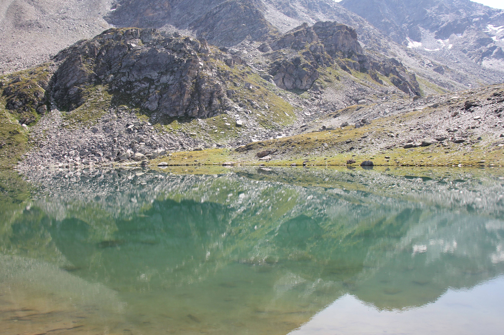

In summer 2019, I had the chance to be close to the Alpians mountains, by staying for 2 months in Munich in the South of Germany, and afterwards travelling Switzerland and South Tyrol in northern Italy. This gave me the wonderful opportunity to go on day hikes through beautiful sceneries. Some photo impressions can be found below.

## Munich

## Switzerland (Sils-Maria)

*View on the Val Fex from Marmoré*

*Panorama View from Marmoré on the Silsersee*

*A lovely reflection of the mountains in an almost still lake*

*View of the glaciers near Sils Maria*

*View on the Val Fedoz from Muott' Ota*
## South Tyrol (Olang)

*Pragser Wildsee, in which you can take a cold bath*

*View of Ober-, Mitter- and Niederolang*
