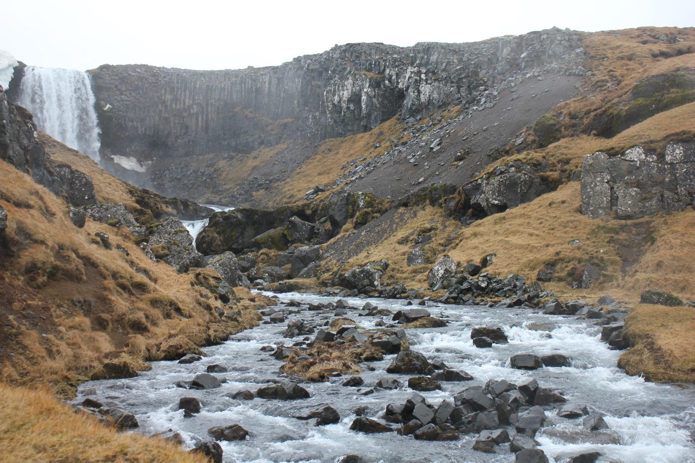

After finishing my internship at the ifo Economic Research Institute in Munich, I made the decision to travel to Iceland. This idea didn't come out of nowhere: I had thought about going to Iceland since the beginning of the year, since an old school friend is doing his semester abroad there. But it wasn't until I had the brainspace to plan such a trip that I made the final call. 

Now, looking back at this experience, I have to say that I am very glad to have done it. Iceland is a beautiful country, and it was even better during a time where there weren't many tourists around. 

## Travelling during a pandemic

### Is it safe?

Of course, it is not an obvious time to travel during a global pandemic. This is why I thought carefully about whether it would be a responsible thing to do. Essentially, I saw two to three risks associated with travelling to Iceland during a pandemic. 

1. **Catching COVID**

    Since COVID is so omnipresent in the media, the first risk everyone thinks about is getting infected. Either during travelling, or whilst being in the country. In my view, the risk of getting the virus becomes overestimated. 

    For me personally, I figured that sitting on a plane with passengers who all did a negative test in the last 72 hours, going into a country that has the lowest COVID numbers in Europe and travelling largely on my own (rather than in big groups) would be a risk that I am willing to take.

2. **Being stranded**

    The risk of being stranded was one that I was more wary about. It could be that just like in the UK, there is some virus mutation and air travel will become temporarily suspended. Then I would be sort of stranded on the island and couldn't return to Germany.

    In fact, during my time in Iceland, the German government issued new regulations for arriving passengers. Everyone had to submit a negative COVID test result before entering Germany - regardless of the country of departure. This made things slightly more difficult for me, but luckily there weren't any other significant travel barriers.

3. **Other risks associated with being in Iceland**

    Before I went to Iceland, there have been multiple earthquakes going on in Iceland, more than usual. This made people somewhat worried. However, since Iceland is so volcanically active, it is a risk that one *always* has when travelling to the country. 

### Necessary preparations for Iceland

As of March 2021, all arriving passengers in Iceland need to pre-register on covid.is. Upon arrival, you need to show a negative COVID test result that is not older than 72 hours, taken from authorized test centres. Once you land in Keflavik Airport, you need to test again. After 5 days of quarantine, you do another test and if that is negative, then the quarantine is lifted. 

If you are vaccinated, you are exempted from testing and quarantine. 

Before coming to Iceland, I made sure to have taken all the necessary precautions, but I was still so anxious that something would go wrong. I was afraid to be turned away at the border because of some formal mistake, so I refrained from doing too much preparation for my trip. 

## Iceland - A Short Overview

Iceland is also called the "land of fire and ice", a name that it absolutely deserves. As an island on the north-atlantic rift, it is very volcanically active. Driving through the country, you will see countless mountains, waterfalls, canyons, lava fields and black sand beaches.

It is very scarcely populated. Iceland has only 350,000 habitants, of which the majority lives in the capital area in and around Reykjavik. The rest of the country is only inhabitated by a few people, in some small villages and farms around the country.

The small population compares to roughly 3 million (!!) tourists that usually come to Iceland within one year. That is a huge number for a small country like Iceland and it was very noticeable how many of the most popular sights in Iceland were designed for a lot of tourists: Big bus parking lots, souvenir shops, restaurants, easy-to-walk pathways to the destinations.

I was told before I arrived in Iceland that there are two seasons: The "cold" season and the "colder" season. I was prepared for rain and snow and windy weather and packed all my outdoor gear. But even with 6 layers, I sometimes was still feeling the cold wind! 

What is more striking about the weather however, is how fast it changes. Within minutes, the weather could go from snow storm, to hail, to blue skies and sunshine! One time, I was cycling about 20 minutes from the east of Reykjavik to the city center and halfway I almost got blew off my bike! However, when I arrived at my destination, it was calm and sunny again. It really was the strangest weather I have ever encountered.

How to "best" travel Iceland? Personally, I like flexibility when travelling a country so I would not opt for a guided tour which would just carry you around in a huge tour bus and give you like 5 minutes for pictures at each destination. If I had arrived in the summer, I might have rented a car and done the Ring Road. This road is the number 1 and goes all around the island. You can easily do it within a few days, or weeks, depending on how much time you want to spend in each part of the island.

But because I came in March, some of the roads were still inaccessible due to the weather and I wasn't feeling comfortable to be on my own for such a long time.

In the end, I had a nice mix of travelling with smaller groups of friends, staying in the capital area and doing day trips from there. I mainly stuck to the South West of Iceland. Though I would have loved to go to the Westfjords and Eastfjords, the weather conditions in March just didn't allow this. All the more reason to go again next time!

## Itinerary

### Snaefellsness Peninsula

The day after I got my negative result from the quarantine, I was finally "free" and allowed to travel the country. My friend from school and a couple of his friends planned to go on a trip to the peninsula Snaeflessness, just north of Reykjavik, so I tagged along.

As we were driving the road up to the peninsula, I was soaking up everything from the landscape that I could (I hadn't seen anything else for a week, apart from the Airbnb and the neighbourhood that I was staying in for the quarantine, so everything was very refreshing).

They say that you can see a lot of Iceland on that peninsula, because it has a lot of great sights to offer: Waterfalls, interesting rock and cliff formations, glaciers...

### Volcano Trip

After the Northern trip, we decided to continue down south. But of course we couldn't miss THE number one attraction within Iceland at that time: The volcano Fagradalsfjall that erupted on the Reykjanes peninsula, just south of Reykjavik.

It has been 800 years that a volcano has erupted on this spot of the island, on the Reykjanes peninsula. What is more: This *type* of volcano was not seen for many thousands of years. Typically, a volcano erupts when underneath the earth's surface, a magma chamber builds up with too much pressure. But the interesting (and sort of scary) thing about this volcano is that the magma is not coming from a magma chamber - which could eventually run out of magma - but rather straight from the inside of the earth!

In order to see the volcano with our own eyes, we had to make sure that the conditions to visit the volcano were in our favour. The wind should be in the direction that one is walking, so that the toxic gases from the volcano do not blow into one's face. And of course, dry weather rather than pouring rain is also preferable.

We were lucky. On the day we planned to go down South, the weather conditions were optimal, so we decided to give it a try. We packed our outdoor gear and snacks for the ride, and off we went. 

In order to get to the volcano, one has to drive to a town called Grindavik, park somewhere along the road there and then hike up the mountains for roughly one hour. It was a manageable hike, flat at first and then with a steep bit at the end. There were a lot of people around: Couples, families with dogs, elderly people with Nordic Walking sticks... It seemed the entire Icelandic population made a day trip to visit the volcano!

Being near it, seeing how the lava bubbles and flows down into the valley was an incredible sight. It was almost "too" perfect: It honestly looked like from a children's book! Like a cone with the tip missing, and from the top of the cone there would be bubbling lava coming out. This is how I always imagined a volcano to look like. 

As we went there in the early days of the eruption, the valley was not yet completely filled with lava. This meant that it was possible to get really close to the volcano, so close you could feel the heat from the lava. And if you weren't careful, you could even burn yourself. Of course, we maintained a safe distance and eventually settled to have our lunch break at a sweet spot with an amazing view. 

### South Iceland

After our visit to the volcano, we went further down South. We rented an Airbnb near the town of Kirkjubaejarklaustur (yes it took me 10 times to get an idea of how to pronounce this name). We stayed there for three nights, just by the edge of a lava field from an eruption many years ago. It was peaceful and quiet, and on my first night there, I was able to witness my first northern lights!

I have to say though, they looked much less impressive in real life compared to the pictures. They are a bit like faint clouds, coloured in green, and sometimes it was hard to distinguish them from actual clouds.

We had two full days in the South. On the first day, the weather was incredible: sunny, no clouds, even warm for Icelandic standards! Though we were kind of exhausted from the previous day's volcano tour, we decided to use the great weather and drive to the West to one of South Iceland's most famous sights: The Glacier Lagoon and Diamond Beach.

The Glacier Lagoon developed as a glacial lake after the Breiðamerkurjökull glacier started retreating. It is filled with ice rocks that float over the lake, making it quite a beautiful and serene sight. The diamond beach nearby (a 10 minute walk towards the ocean) is a black sand beach that got its name from the many pieces of glacier ice that are washed unto the shore. Shining in the sunlight, they are like many pieces of diamonds on a black surface. As pleasing to the eye as these sights are, it is a tragedy that their expansion is due climate change - and after a few years, there might be no glacier left in this area anymore. 

On our way back from the Glacier Lagoon, we encountered a hidden gem, the Mulagljufur Canyon. It was actually quite a coincidence, since I was just googling sights on the way back which we could have a look at. I am so glad I came across this canyon on a random travel blog! It was really tugged away, and we had to walk for roughly one and a half hours to get there. There were no clear navigation signs and no prepared path, but some sticks that indicated we were on the right trail. At the end, we were rewarded with an amazing sight:

We went to another famous canyon, the Fjaðrárgljúfur Canyon, which I found still beautiful but not as rewarding as the one that was more tugged away. It just felt like more of an adventure to discover it!. Fjaðrárgljúfur Canyon is very accessible by car and has ready-built viewing platforms.

### Reykjavik Area

Being in Reykjavik was great after some more intense travelling in the South. I am grateful to my friend who allowed me to stay in their student housing. And honestly, it felt at times a bit like I was a student again. There was a common room kitchen, where people from the floor would hang out with each other, chat and even have parties (wow what a life we had pre-pandemic). Since it was the "international" dorm, I'd meet people from different places, including US, Australia, Taiwan, France ... It was just like in my university days again! Made me really miss the student life.

What was also really nice is that I could tag along in my friend's German friendship group. They are a lovely bunch of people, most of them doing engineering or business and accounting. We did Yoga together, went running, played boardgames, one of them even cut my hair!! I felt so welcomed and happy to be around with them that I really wanted to cook for them — that is my way of expressing gratitude and affection. So one evening, after a run to one of Reykjavik' Asian grocery stores and 4h of cooking, I was able to feed a crowd of 9 people, which included vegans and gluten-free people.

### The Golden Circle

When looking up "Things to do in Iceland", the Golden Circle was always the first thing that popped up on every tourist guide website. However, I didn't really get what the Golden Circle *was*. Was it some form of crater, which looks like a golden circle?

In fact, the Golden Circle is a collection of many sights. It is called "Golden Circle", because it is possible to visit these sights in one loop from the capital, and it is doable within a day. On that route, one can visit the Thingvellir National Park, Gullfoss Waterfall, Geysirs, a Crater and many other sights.

My friend and I did the Golden Circle almost at the very end of my stay in Iceland. We rented a car, which gave us lots of flexibility and time to stay at the places that we liked, and skip the ones that we didn't want to go.

Maybe I was spoilt from my travels in Iceland prior to doing the Golden Circle, but the sights didn't exactly blew me away. Don't get me wrong: It was still incredibly impressive! But I think what contributed to this is that the whole infrastructure at Golden Circle sights is very clearly made to accommodate a lot of tourists in a short period of time. By that I mean, there are huge parking lots literally next to the sights, so that one only has to walk 2 minutes from the car door to one of the most amazing waterfalls. There would be wooden paths and reilings, souvenir shops and cafés. In sum: It is very *easy* to visit the sights. 

Of course, there is nothing really wrong with that, and it gives many people the chance to appreciate Iceland's beautiful nature within a short period of time. But for me personally, there was no challenge, no feeling of accomplishment. You drive there, take a photo, leave and that is it. It is just too easy!

Therefore, in hindsight I would say that my favourite sight from the Golden Circle was the Reykjadalur, a geothermally active valley known for its hot river in which people can enjoy a bath. In order to get there, we had to hike for around 1 hour up the mountain. This is what made me appreciate the river even more - if we could just drive there it would have still been nice, but just less interesting and rewarding. 

The river was really hot hot hot, just like in a whirlpool. There weren't changing cabins, just small walls behind which one could change into bathing gear. Sitting in the river, we were were feeling warm, but at the same time surrounded by snow. This reminded me again of Iceland's name of "land of fire and ice" and how true this is. Surprisingly, when coming out of the water and getting changed into my hiking clothes again, I wasn't feeling very cold due to the rest warmth on my body. 

### The Westman Islands (Heimaey)

For my last full outdoor day in Iceland, my friend and I with some of his housemates went to another island! Namely, to Heimaey, the largest island of the Westman Islands, just south of Iceland. Taking a ferry for about 40 minutes to get there, we found ourselves on a small island with just 5,000 habitants.

In 1973, there was a volcano eruption that changed many of Heimaey's locals' lives forever. It erupted in the middle of the night, and lasted many months. The volcano, Eldfell is its name, covered many houses into meter-deep layers of ash. Luckily though, no one was injured or died from the eruption as all could be evacuated in time.

The museum we visited there, which documented the volcano eruption was one of the best I've been to. It had an audio guide with excellent storytelling, interactive exhibitions, high-tech equipment...

We also hiked up the volcano and were able to see almost the entire island in one 360° panorama view.

The islanders have an interesting activity, that kids usually do for fun, called "Sprangan". It basically consists in using a rope, that is hanging down a cliff, and jumping off the wall, trying not to hurt yourself. We tried it out and it was great fun!

## Concluding Thoughts

Overall, I enjoyed the trip very much and am glad that everything went as planned. I got very lucky that Iceland, at this point during the pandemic, is still allowing visitors and that I could afford to spend 5 days in quarantine. And of course, that I was able to witness a volcano explosion live! What a lucky coincidence.

Furthermore, I am glad that I just decided to "do it". Too often in life, things do not happen because we think we should wait for the "perfect moment" to come. But this moment might never come -- we are responsible for taking the initiative ourselves and making things happen. That is why at the beginning of the year, I set myself a motto to literally "just do it" when I felt that there was an idea or project in my head.

What made this trip also so enjoyable is that I knew someone living/studying in Iceland. This made it a lot more authentic: He had much more knowledge about the conditions there and since my friend also had a friendship circle there, I was integrated very smoothly into their activities. Apart from the stunning landscapes, hanging out with lovely people was what I enjoyed the most!