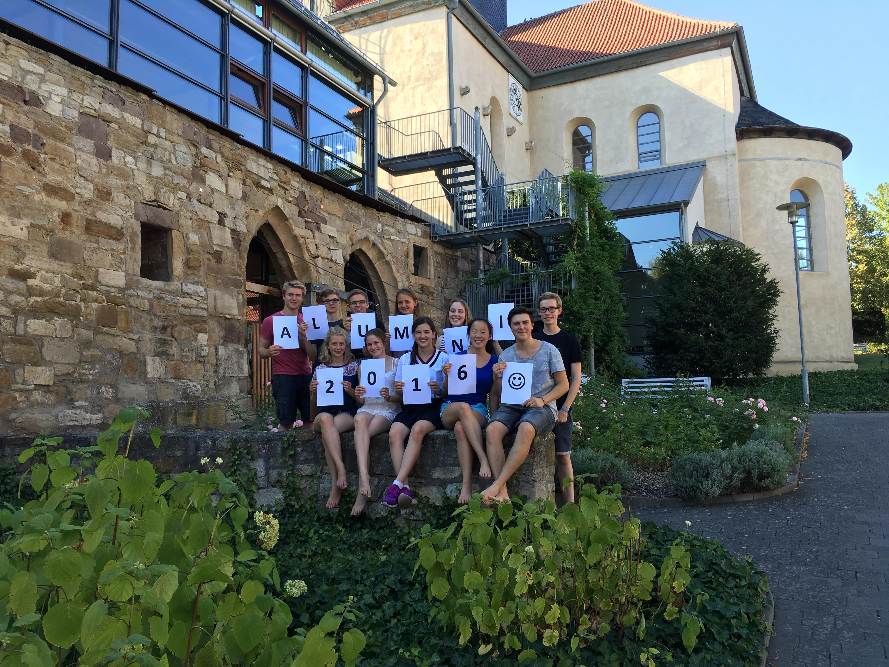

Democracy needs people who ask questions. People who state their opinions and also engage with opinions of others. People who can listen. Democracy needs people who can have a fair and fact-based debate. 

This why the debating competition "Jugend debattiert" exists.

If it weren't for Jugend debattiert, I wouldn't be where I am today. It had a great impact on my subject of study and analytical thinking and it has resulted in many meaningful friendships.

My goal in this article is to explain what makes Jugend debattiert special and why it has had, and continues to have, such a significant impact on my life.

## What is Jugend debattiert?

Jugend debattiert (JD) is a nation-wide debating competition in Germany. Students from grade 8 to grade 13 can participate. They start debating in class and school level and with each qualification round they can move up further: to the district, the federal state and finally the federal level. Once they reach higher levels, students receive trainings in rhetorics and communication, further fine-tuning their debating skills. Those who make it under the finalists on federal level are rewarded with a membership in the Alumni association of Jugend debattiert.

This year, JD celebrates its 20 year anniversary. It started as project with 30 schools in Frankfurt. Now, there are over 200,000 students participating each year from all across the country. Under the federal president's patronage, the competition is funded by the German Ministry for Education (BMBF) and supported administratively by the [Hertie Foundation](https://www.ghst.de/en/) in Frankfurt.

### The debating format

The rules of the JD debating format are quite simple. They are deliberately designed this way, to make learning how to debate easy for students.

The motion in a JD debate have a special form. It is always framed as a question that starts with "Should..." (german: "Soll") and can be answered with "Yes" or "No". Examples include: "Should there be a mandatory student exchange for middle school students?", "Should invidiual limits to airplane tickets be introduced?", "Should people, who are vaccinated against COVID-19, regain fundamental freedoms?". Debating motions are often taken from current political issues and/or are of general societal and political relevance.

A debate consists of 4 debaters, 2 on the "Pro" side and 2 on the "Contra" side. Those who desire a change of the status quo begin, i.e. whose answer to the motion "Should...?" is a "yes".

Each debate lasts 24 minutes. It is split into three parts:
- **Opening round** (Eröffnungsrunde): Each debater has 2 minutes to give an opening statement, where they give their answer to the motion.
- **Free discussion** (Freie Aussprache): For 12 minutes, arguments are being exchanged, without strict time limit of individual speaking time.
- **Closing round** (Schlussrunde): Each debater has 1 minute to give a closing statement, where they once again give their answer to the motion and give the decisive reason for their position.

#### Jugend debattiert v. British Parliamentary Style

The JD format differs in important respects to other, more known styles of debating such as the British Parliamentary Style (BPS). BPS is often the debating format of choice on university level. Here are some points on which they differ:
- **Number of speakers**: BPS has 8 speakers, 4 of which belong to the "Government" (the party in favour of a motion) and 4 that belong to "Opposion" (the party against a motion)
- **Type of motion**: Whereas in JD, the motion is a question in the form of "Should...?", a motion in a BPS debate is usually phrased as "This House believes that..."
- **Free Discussion**: In BPS, the debate consists of the speakers holding their speeches one after another. There is no designated time to have a free-flowing discussion of arguments as in the middle part in the JD format.

There are advantages and disadvantages to both formats. Personally, I "grew up" with the JD format and found the BPS format very hard to get used to, which is why I didn't debate much on university level.

## My journey

As said in the intro, Jugend debattiert has had a great impact on my path. Even after 5 years, I feel a strong connection to debating, the competition, the people that make up JD. I feel so grateful for everything it has taught me, the inspirations that it gave me and the many opportunities that I continue to benefit from. 

For each debate, we would research and prepare thoroughly each side of the arguments. It was during this time that my interest in politics deepened. I started to consider studying a subject that was non-STEM (I wanted to study chemistry back in middle school) and so I decided to do interdisciplinary study in Philosophy, Politics and Economics. If it weren't for Jugend debattiert, I would have never even gotten the idea, nor made a successful application.

I first encountered the idea of JD because one student from my school (who incidentally, became my boyfriend later on) won the federal competition in 2015. When asking him about his experience, he talked in such positive terms of his learnings from Jugend debattiert, that I was convinced I wanted to participate myself. I was lucky: My German teacher at the time was also respomsible for organizing JD at our school, so I was able to just tag along in the weekly debating sessions.

That is how it began...

### Competition: 2015/16

The moment before my first "proper" debate in the school competition, I was incredibly nervous. My heart was bumping fast before my first speech. The motions were: "Should applications, before the interview stage, be anonymized?" and "Should it be manatory for cyclists to wear helmets?". After the initial exchange of opening speeches however, I calmed down. I even started to enjoy the process of debating and the "fight" for the best argument.

When passing the district level, we got our first "prize": A three-day rhetoric skills seminar. It was a really eye-opening experience, because it was the first time that I formally learnt the rules and techniques of the JD format (previously, I just watched a lot of previous debates).

One technique which I found extremely useful was the distinction between different dimensions of discussion. Previously, I would always think of arguments in terms of "for" or "against" a certain measure. _Pro or Con_. But when we look at a political measure, for example, introducing a limit on individual flights, there are multiple dimensions to look at. 
First, **feasibility**: Is it even feasible to restrict flights to a certain level? What necessary changes of law would that entail? Can that even go through? 
Next, there is the question of **suitability**: Is _this_ particular political measure suitable for addressing the problem? If our concern is environmental pollution, are there perhaps other, less infringing measures we can take? 
Finally, there is the question of **appropriateness**. Even if the measure is feasible and suitable to address the problem, is it also appropriate? This concerns other values and rights that are societally desirable. With an individual flight limit, our freedom of movement would be limited. Is this justifiable?

These three dimensions helped me to "group" arguments into different categories and structure the debates more clearly. With newly learnt skills, I went off to debate on the federal state level.

The [finals in my federal state](https://www.youtube.com/watch?v=3LZkst_u_wg), Hesse, took place in the Hesse Broadcasting House in Frankfurt. It was a big auditorium, with podiums and microphones. We did a mic check before our debate. There were even live performances taking place during the breaks! It was all so grand and exciting. 

Our topic for the final debate was: "Should Hitler's "Mein Kampf" be a mandatory reading in the syllabus of all secondary schools?". I was arguing against. The Pro side argued that reading such a primary source would make history education in secondary schools more tangible. Learning about the horrors of the Nazi regime and the second World War is part of the Curriculum in German Schools anyway. However, our Contra side argued, the goal of raising historical awareness can be achieved by other means as well, it doesn't have to happen through reading Hitler's book, which was long and not well-written, anyway.

When the results were announced, I couldn't believe my ears. I had actually scored first place! Never, ever did I think that I would make it this far and that I would actually qualify to debate in Berlin! After the official part of the day was over, me and the 2nd winner were interviewed by the Hesse Broadcasting service in their studio and it was broadcasted that evening (My 5 minutes of fame, haha).

For all winners at federal state level, there would be another rhetoric skills seminar. We came from all 16 federal states, had a five-day long intensive training to prepare us for the the federal level. I loved the experience of learning with so many talented, impressive people. Of course, inevitably I also felt "inferior". There were many who were really good, eloquent and quick with their arguments. I didn't feel like I stood a chance.

Though I didn't make it in the federal debates under the final four, I still scored 6th place in the end, which meant that I was admitted into the Alumni Association of Jugend debattiert. I felt honoured back then, but little did I know just _how_ rewarding the exchange with the other Alumni would be and how many long-lasting friendships would emerge.

As "prize" for our success in the federal debates, the top 12 debaters were invited to a week-long seminar in the summer after our participation. I remember this to be one of the best weeks of my life: It was filled with learning sessions about philosophy, rhetorics, communication skills and a ton of fun. We did trips to the surrounding sights, enjoyed the amazing weather and had many engaging conversations. In the end, we even put together a performance, with dancing, poetry and singing!

### Post-participation: Engagement as alumna 

Coming out of the competition year, I had a lot of motivation to continue staying engaged with the JD community. Just a few months after the finale in Berlin, I went to the yearly alumni gathering which was held in Göttingen. It was great seeing my friends again, as well many new faces of former participants. During my last year at school, I also supported the competition as a jury during the district and federal state level competition. 

After graduating from highschool, I went straight to uni in the UK. The geographic distance often made it difficult to participate in events of JD. For example, I couldn't attend a single event during my first year at university, such as the finale in Berlin or the yearly alumni gathering. But I made an active effort to stay in touch, we kept our WhatsApp group alive and met in pairs or threes occasionally.

Ironically, now that I am back in Germany, a global pandemic has forced JD to go digital. This also has advantages: People who feel connected to JD can now join in from wherever they are. I was able to support different seminars throughout the year now, in Hamburg, Rheinland-Pfalz, Mecklenburg Vorpommern... Under usual circumstances, I wouldn't have the time to travel to all these place, but this way, I can just open my laptop and join in from afar!

In fact, I am writing this post just as I come out of judging a regional competition in Mecklenburg-Vorpommern. They were looking for judges on a short notice and I was able to just log on and help out. That's the wonders of our digital age now.

## Conclusion

I love Jugend debattiert, because it comprises a thriving community of politically engaged, open-minded yet critical thinkers. I love it because it is making an active contribution to the "Streitkultur" of Germany and beyond. Via Jugend debattiert, young people learn what it means to engage with other people's opinions and to substantiate one's own.

With everything that it offered me, I can only hope to give back a small portion.
