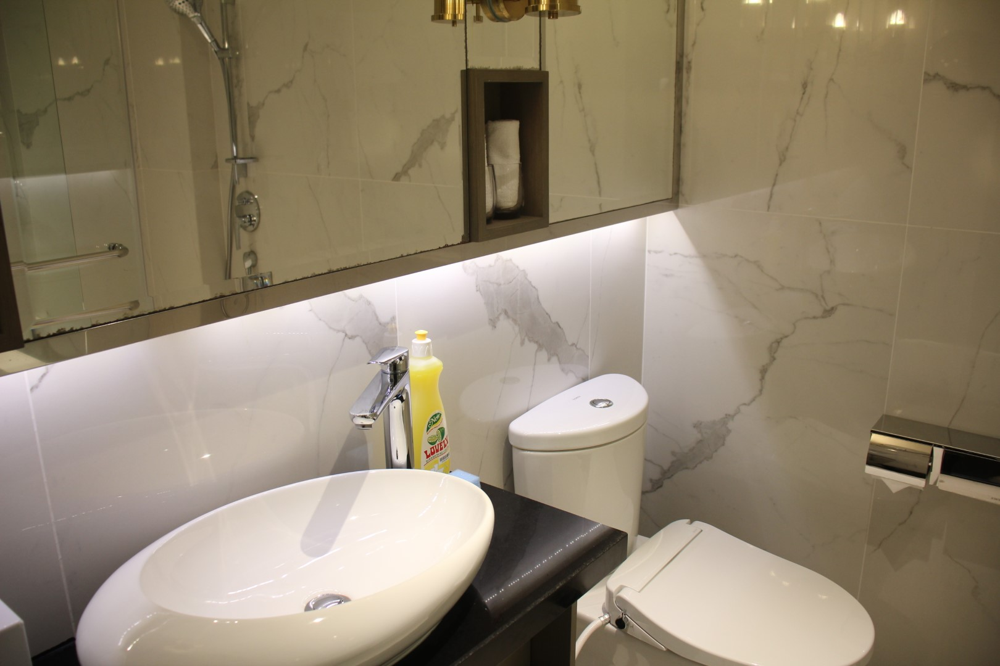
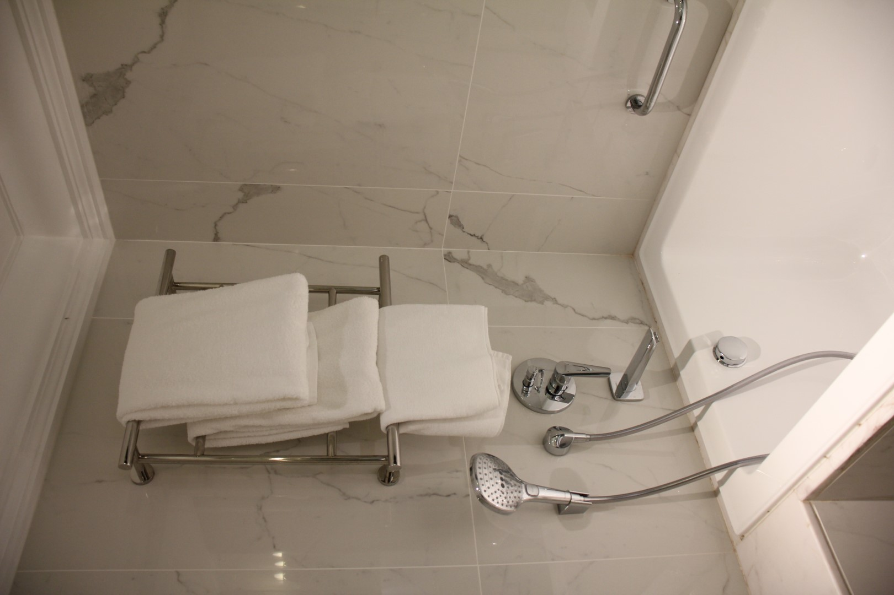
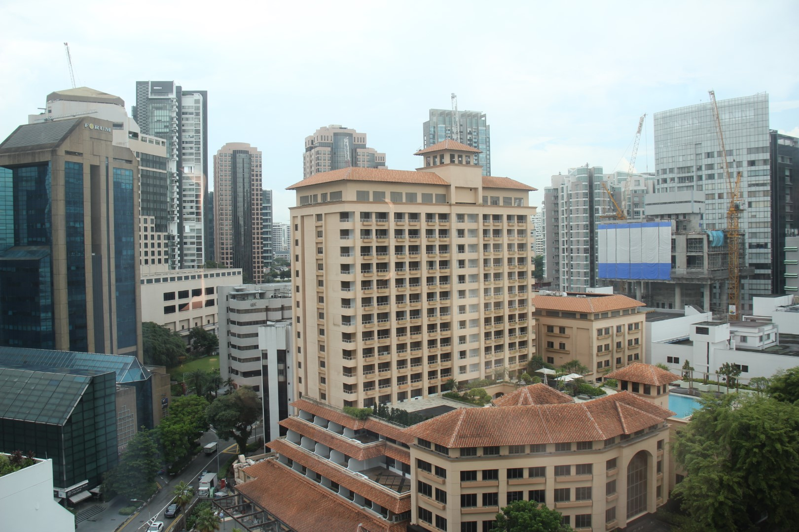
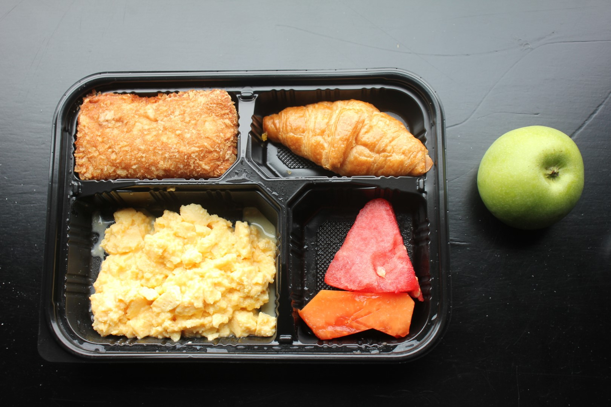
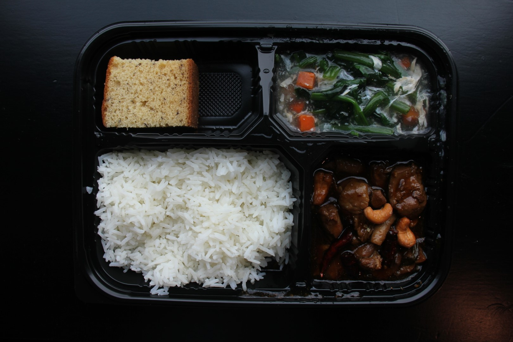
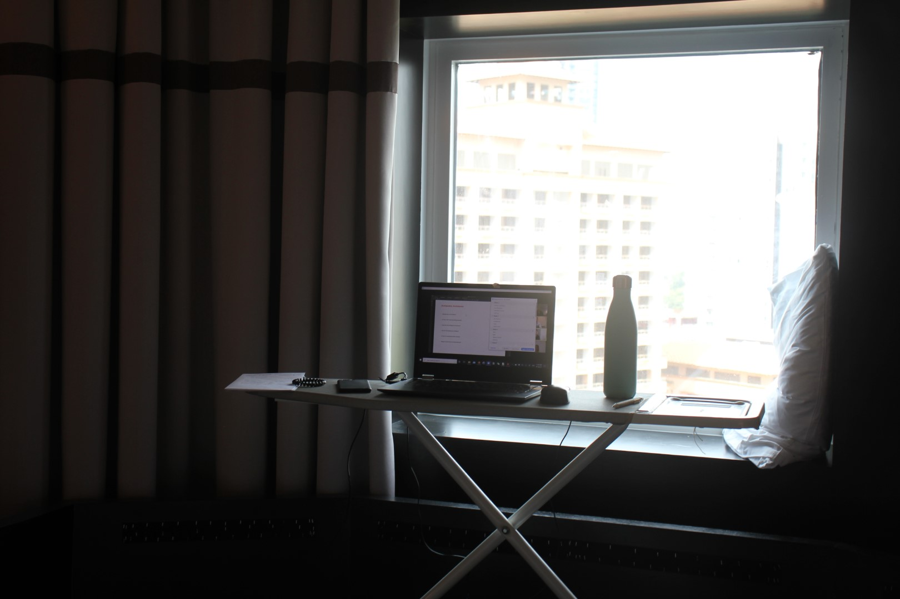

<!-- TOC -->

- [Overview](#overview)
    - [Goals for the quarantine](#goals-for-the-quarantine)
        - [Exercise Goals](#exercise-goals)
        - [Extracurricular Activities](#extracurricular-activities)
        - [Work on my survey project](#work-on-my-survey-project)
        - [Get a job + start working](#get-a-job--start-working)
        - [Read Books and Poems](#read-books-and-poems)
        - [Stay Social](#stay-social)
    - [Daily Log](#daily-log)
        - [Week 1 and Arrival: Adjusting, building routines and ... falling ill](#week-1-and-arrival-adjusting-building-routines-and--falling-ill)
        - [Week 2: Time flies if you're having fun or work](#week-2-time-flies-if-youre-having-fun-or-work)
        - [Week 3: Anticipating the end](#week-3-anticipating-the-end)
- [Concluding thoughts](#concluding-thoughts)

<!-- /TOC -->

# Overview

In May 2021, I spent 21 days locked in one single hotel room.

Why would anyone do this to themselves? For me, it was the "necessary evil" that I had to go through in order to see my boyfriend and his family in Singapore. Most arriving travelers into Singapore have to serve the so-called "Stay Home Notice" (SHN), which means that they have to stay in a dedicated quarantine facility or in their house of residence.

Because Singapore recently had a spike in cases, they extended the quarantine time to 21 days from than the original 14 days. Even though I already got full vaccination, there was no exception. The Singaporean government doesn't kid around when it comes to pandemic controls. 

As for the hotel, I couldn't choose which hotel I was being allocated to. It ended up being an old-ish but decent 4-star hotel in the City Centre, by Orchard Rd.

My hotel room was rather small, but decent. It has basic equipment like a TV, kettle, hairdryer, ironing board, some tea and coffee. The window couldn't be opened but at least I had a pretty decent view unto Orchard Rd, Singapore's main high-end shopping street.

Meals get delivered to my room, 3 times a day. They are a Bento Box of assorted stuff, some rice or noodles with veg and some protein. Over the course of the stay, I made some requests to the hotel to accommodate my dietary preferences (pescetarian, replace cake with fruit, more veggies than carbs) and the hotel was kind enough to do that. 

Here are some examples of food I got on my first day:

Finally, a question I got asked a lot was: "What do you DO all day long? Do you not get bored?" And the truth is, I actually didn't. There always seemed like something to do. I made myself an improvised standing desk with the ironing board which actually worked quite nicely.

OK, sometimes I did get a bit bored, in which case I tried to do something creative. In my case, this was filming myself for a day to shoot a video that shows how I spend the time in the room. Feel free to watch my [Youtube Video on a typical day in hotel quarantine](https://www.youtube.com/watch?v=-YhOJvbU1rw).

## Goals for the quarantine

These are goals I set for myself at the start of the quarantine:

Three weeks cooped up in ONE single room is no joke. Most of us are lucky that we didn't have to go through this the first time around, when the first waves of the pandemic hit hard and people had to stay in their homes 24/7. Instead, what was called "lockdown" in the UK or Germany still allowed for leisurely strolls in the park or even walks with friends.

But at the same time, I want to approach these few weeks with a positive mindset. This can be also an opportunity: An opportunity to have more time with myself, to chill and do things that I usually wouldn't have the time for, a chance to build some good habits that hopefully last beyond the quarantine.

Routines are important to me. This is why I want to incorporate some daily habits into some bigger projects during this time:

### Exercise Goals

I want to stay active and fit throughout these three weeks. I know it is going to be hard. Naturally, I won't be exercising as much as I would usually and also burn not many calories since I will be sitting most of the time. But still, I want to do my best.

- Do 10,000 steps each day, either by doing a daily "jog" (I brought a rope with me) or through walking on the spot
- Do a daily workout of at least 30mins + maybe a daily dance session?
- Practice my handstand: Be able to finally hold it without a wall and manage to do a proper kick-up. Ideally, I would be able to hold it comfortably for 10 seconds or longer
- Stretch or Yoga in the evening before going to bed

### Extracurricular Activities
- Conduct Jugend debattiert China seminar + the debating finale
- Conduct Jugend debattiert Asia seminar
- Prepare and host a web seminar with Huada-Chinese-School on "Why should we learn Mandarin?"

### Work on my survey project
- Contact organizations/academics who could sponsor my survey project (more details on the project in a separate post, once it is completed)
- Read up on how to sample the "hard-to-reach" population
- Familiarize myself with the literature
- Put all the questions into Qualtrics to be ready to send out when the time is ripe

### Get a job + start working
- Figure out whether I can do a freelance consulting job with GIZ China
- Start work and get to meet colleagues

### Read Books and Poems
- Learn one new Chinese poem each day
- Read one Chinese novel
- Read a book on Singapore's history

### Stay Social
- Catch up with friends and use the time to reconnect with those I haven't spoken to in a long time

## Daily Log
Below I wrote down on a weekly basis how I spent my time.

### Week 1 and Arrival: Adjusting, building routines and ... falling ill
Before coming to Singapore, I had to take care of many logistics: Pack my luggage, get gifts for the family, obtain a negative PCR test result 72h before departure, fill in a Health Declaration Form... Even though I knew that I did all that I could and was supposed to (according to government websites), I was still nervous before my flight. I was nervous some immigration officer would not accept my papers or that regulations would change last minute. 

But luckily, everything went smoothly. I flew from Munich Airport to Changyi Airport in Singapore, with one stop in Abu Dhabi. On the flight, I learnt about Singaporean history with the in-flight entertainment system, and was surprised to find that Etihad Airways, the national airline of the UAE has the Quran as audiobook and a Mecca Pointer available. Welcome to the Arab World!

After landing, I went through multiple checkpoints, each accompanied by masked staff dressed full-body personal protection. Before even passing the immigration checkpoint, I already got asked 3 times "Madam, why are you here? Are you here on a study permit?". That got me slightly anxious, but luckily the immigration officer let me through without asking many questionsl

Singaporeans speak with a distinctive accent, which I immediately recognized all around me at the airport. Everyone spoke like Zhenghong! 

After immigration, I went to do a swab test, which was actually the most uncomfortable I have ever done (and I have done quite a few by now). Then we boarded a bus which would take us to our quarantine hotel.

I had no idea where we were going. They don't tell you that in advance. But after we entered the city centre, I asked a couple next to me and they said they knew we were staying at Orchard Hotel, a 4-star hotel.

We arrived in the hall, got instructions and our keys to the room. Before entering the room, I took a deep breath -- the last breath in "freedom" for 3 weeks. 

Entering the room, I immediately chekced what sort of amenities they had. They were basic, but most of the stuff I needed was there. 

We got our first meal served, one of many bento boxes to come. I realized that they hadn't asked for dietary requirements, so I called the front desk to let them know I eat pescetarian. They were kind to immediately change that in their system.

I went to bed late that night, hoping that this way, I would have a good night of sleep and overcome my jetlag. That's what happened, I slept a full 11h ...

The first weekend after my arrival on Friday went by really quickly. This was because I was busy running an online debating seminar which ran for about 5h each day.

I started trying to develop some routines, like doing some Yoga in the morning after waking up, having lunch and dinner at scheduled timings (it helps that they deliver it always at the same time), doing work for my two freelance jobs.

I got a very pleasant surprise by one of my friends from Singapore: She got me a little welcome card and fruit tea and they delivered it up to my room! Was a really cute gesture that made my day :)

Other than that, I have been trying to arrange my living space on 28sqm. I try to dedicate certain spots for certain activities: Place in front of the door is for exercise, spot next to the window for work, eating by the window sill with view on Orchard Rd... This way, I hope to recreate my usual living space, where each spot has a dedicated purpose.

My sleep schedule is still not fully adjusted, mainly because I try to stay in touch with people from Germany, too, and they are mostly free in the evenings. I sleep from about 1-2AM to 10-11AM...

Very unfortunately, I got sick in the middle of hte first week. I got some form of stomach flue. I thought it was the Indian dinner I had the night before, which was VERY spicy...

Anyway, Zhenghong came by on his day off with some fruit and other goodies, and I also got medicine from the pharmacy. I spent all day lying in bed without much appetite, but hopefully this will get better in the next few days.

After I recovered from my weird stomach flu, I picked up things slowly but steadily. I didn't start exercising but instead scheduled lots of calls with friends. Really nice to catch up wtih them again.

### Week 2: Time flies if you're having fun (or work)

During the second week, I kept busy and occupied with doing work. I got more tasks for my freelance job with my former employer, Sinolytics, doing a few research and admin tasks. I spent around 4 working days on this, and by having things to do, time actually went by very fast.

During my second week, I shot a short video on a "typical day". It was quite fun to shoot and edit and I sent it to family and friends so that they get a little insight into how I am actually spending my days here. You can watch it [here](https://www.youtube.com/watch?v=-YhOJvbU1rw).

Very often, I get the question "What do you DO all day? Don't you get bored?" And after this second week, I have to say that I actually don't get bored, because there always is something to do. And if there isn't, I will find something. I think the key to staying sane in quarantine is to keep occupied with something.

Apart from work, I also spend almost two full days on my extracurricular activity, supporting the Jugend debattiert competition internaionally. After the training for Chinese students last week, we are now hosting a debating tournament that runs for two days. During the tournament, the Chinese students will debate (in German) about whether COVID-19 vaccinations should be mandatory, whether exams in school should be allowed to be written on computers and whether allocation to a secondary school should be random, rather than based on grades. 

It is always great fun to organize these kinds of events and I feel really blessed to be part of the debating community. I feel especially fortunate that I can work so closely with one of the founders of the competition, who has also been the driving force to bringing Jugend debattiert to China. I admire his wisdom, skills and humour very much and can learn a lot from him.

On Day 14 of my quarantine, I actually got out of my room for the first time in two weeks. A COVID-19 test was scheduled to take place in the same hotel I was staying at, so I had to go downstairs to take it. A whole new hotel floor - a whole new world!! There were a lot of people in full-body PPE managing the queues. There are always *so* many people standing around to enforce the hygiene standards. They did a thorough swab test, which was quite uncomfortable in my nose, but it was quite quick.

With only 5 more days to go, I actually feel like this time has passed really quickly. I look forward to getting out of course, but part of me also feels like this hermet life isn't so bad after all. Is that weird?

### Week 3: Anticipating the end

I arrived on a Friday, so I would also get out on a Friday. This last week wasn't a proper week then, but more like 4 and a half days. These also went by very quickly and I was surprisingly busy. I co-led another debating seminar together with other Jugend debattiert Trainers, this time for students from German Internantional schools in Asia.

Apart from that I started my second freelance job (with GIZ China) and started doing some research and drafting work for them plus getting to know the team. Simultaneously, I wanted to catch up with other friends because I knew that once I got out, it would take me some time to adjust and I wouldn't have much time. It was a bit of a challenge to juggle my different online calls throughout the days but it worked.

On Friday morning, I was waiting impatiently for the results of the PCR test I did the day before (same procedure as on Day 14). The hotel told me my check-out time was at 12:30, but that it also depended on when I got my test results from the Ministry of Health. Checking the time very frequently, I paced up and down my room, hoping that they would come very soon. I spent 3 weeks in this room but the last 3 hours felt much longer...!

At last, they gave me the test results via a WhatsApp Call and so at 12:30, I went down to the hotel lobby to check-out. I had arranged with Zhenghong that he should meet me at the hotel lobby, and that we would walk around Orchard Rd first before heading to his home. I dropped off my luggage and... waited again.

There he came, finally, walking down the street. I came toward him and jumped into his arms. Three weeks stuck in a room, it was all worth it for that moment.

# Concluding thoughts

I was surprised by how well I managed being inside one room for 21 days. At first, I was very worried that I would be feeling claustrophobic, or not getting enough movement in my day and feeling very lethargic and unproductive. 

As for my goals which I set at the beginning of the quarantine, I met some of them but not all. Of course, staying in one room all day long meant I wasn't active as I would usually be. Meeting my goals of 10,000 indoor steps a day was too ambitious I quickly realized, so I had to tune it down a notch to 5,000 steps (which was more doable). 

I did manage to stay engaged with friends by videocalling a lot and helped organizing debating seminars or attending online seminars was also very social. So I actually never felt "lonely" in the three weeks. And it didn't get too boring, either.

So overall, I would say that I managed to keep good routines and stay engaged during the three weeks. I believe that *keeping busy* was the key to staying sane and having time pass by quickly. I was fortunate that I had quite a couple of things I wanted to do. And now that the quarantinen is over, I feel once asserted in the view that even if challenges seem very daunting at first, once you tackle them it becomes much less scary.

Now, the real adventure begins: Exploring a new country, learning about the culture, trying out lots of different food... will keep you posted :)