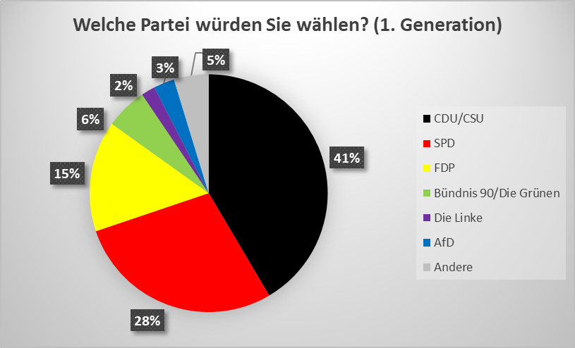

# Vorstellung des Umfrageprojekts

Deutschland hat gewählt. Am 26. September 2021 waren alle Menschen mit deutscher Staatsbürgerschaft dazu aufgerufen, ihre Stimme für die Bundestagswahl abzugeben.

Ich habe diese Bundestagswahl zum Anlass genommen, ein Umfrageprojekt durchzuführen. Es geht darum, die politischen Einstellungen von Menschen mit chinesischem Migrationshintergrund zu untersuchen. Es haben über 260 Personen an der Umfrage teilgenommen (Stand 28.09.2021, 14 Uhr).

## Datensammlung

Für den Zweck dieser Umfrage unterschied ich zwischen zwei Generationen von Menschen mit chinesischem Migrationshintergrund: Der 1. und der 2. Generation. 

Die 1. Generation sind diejenigen Immigrant:innen, die in China geboren und aufgewachsen sind. Sie sind erst nach ihrer Kindheit nach Deutschland gekommen, z.B. für Studium oder Arbeit. Die 2. Generation sind diejenigen, die entweder in Deutschland geboren und aufgewachsen sind, oder zumindest den Großteil ihrer Kindheit und Jugend in Deutschland verbracht haben. Ob jemand zur 1. oder 2. Generation gehört, wurde am Anfang der Umfrage ermittelt.

Die Umfrage wurde über soziale Medien (hauptsächlich WeChat, WhatsApp und Messenger) verbreitet. 

## Vorläufige Ergebnisse

Im Folgenden die ersten Auswertungen. Aus Zeitgründen sind zunächst nur die Daten aus 4 Fragen veröffentlicht. In einer weiteren Auswertungsrunde werden die anderen Ergebnisse folgen.

### Erste Generation

Insgesamt haben 244 Personen an der Umfrage teilgenommen, die der 1. Generation angehören.

### Zweite Generation

Insgesamt haben 24 Personen teilgenommen, die der 2. Generation angehören. Diese Umfrageergebnisse sind somit nicht repräsentativ zu verstehen, da die Zahl der Teilnehmenden zu gering gewesen ist.

## Danksagung

Diese Umfrage ist das Ergebins eines monatelangen Prozesses, und wäre ohne die Unterstützung einiger Menschen nicht zustande gekommen. Besonderer Dank geht hier an meine Familie, die die Umfrage als allererstes gelesen, getestet und verbessert hat. Vielen Dank auch an alle Freundinnen und Freunde, von denen ich wertvolles Feedback bekommen habe.

Abschließend geht natürlich ein großes Dankeschön an alle Teilnehmerinnen und Teilnehmer der Umfrage. Ich habe mich sehr über Ihre Bereitschaft gefreut!

Die Umfrage ist weiterhin aktiv. Falls Sie noch nicht mitgemacht haben, können Sie das unter diesem Link tun. --> [Zur Umfrage](https://oxforddpir.eu.qualtrics.com/jfe/form/SV_3QtAO4IDE2FGhdI). Alle Daten werden selbstverständlich anonym und vertraulich behandelt.
