<!-- TOC -->

- [Einführung](#einführung)
  * [Motivation des Umfrageprojektes](#motivation-des-umfrageprojektes)
  * [Umfragedesign](#umfragedesign)
  * [Durchführung](#durchführung)
- [Ergebnisse](#ergebnisse)
  * [Demographie der Teilnehmenden](#demographie-der-teilnehmenden)
  * [Wahlverhalten](#wahlverhalten)
- [Fazit](#fazit)

<!-- TOC -->

# Einführung

Von Frühjahr bis Herbst 2021 habe ich ein Umfrageprojekt durchgeführt. Bei diesem Projekt geht es um die Frage: Wie ist das politische Wahlverhalten von Menschen mit chinesischem Migrationshintergrund in Deutschland?

In diesem Bericht erläutere ich meine Motivation hinter dem Projekt, die Durchführung der Umfrage und präsentiere die Ergebnisse. 

## Motivation des Umfrageprojektes

Seit ca. den 1980er Jahren, also seit der Reform- und Öffnungspolitik Chinas unter Deng Xiaoping, hat es mehrere Einwanderungsbewegungen von Chines:innen nach Deutschland gegeben. Diese Chines:innen haben ihre Kindheit und Jugend in China verbracht und sind später zum Studium oder für Arbeit nach Deutschland gezogen. Manche von ihnen sind in Deutschland geblieben und haben teilweise auch die deutsche Staatsbürgerschaft angenommen. Ich selbst bin ein Kind von chinesischen Einwanderern nach Deutschland. Meine Eltern kamen in den 1980er Jahren als Student:innen nach Deutschland, haben später hier Arbeit gefunden, sich einen Freundeskreis aufgebaut und sich hier niedergelassen. 

Ich bin in Deutschland zur Schule gegangen, spreche Deutsch als Muttersprache (neben Mandarin) und identifiziere mich primär als Deutsche, auch wenn ich meine chinesischen kulturellen Wurzeln sehr schätze.

Um meine persönliche Erfahrung zu komplementieren, wollte ich ein größeres Datenset sammeln, um repräsentativere Aussagen treffen zu können. Ich strebte also an, Daten über das politische Wahlverhalten von Menschen mit chinesischem Migrationshintergrund zu sammeln und auszuwerten. Wie unterschiedlich "ticken" wir? Im Vergleich zueinander, aber auch im Vergleich zur generellen deutschen Bevölkerung?

Meines Wissens nach gibt es bisher keine Studie mit diesem konkreten Forschungsfokus. 

## Umfragedesign

Um einen Vergleich zwischen der älteren und jüngeren Generation vornehmen zu können, unterschied ich in der Umfrage zwischen zwei Generationen.

Die 1. Generation sind diejenigen Immigrant:innen, die in China geboren und aufgewachsen sind. Sie sind erst nach ihrer Kindheit nach Deutschland gekommen, z.B. für Studium oder Arbeit. Die 2. Generation sind diejenigen, die entweder in Deutschland geboren und aufgewachsen sind, oder zumindest den Großteil ihrer Kindheit und Jugend in Deutschland verbracht haben. Welcher Generation die Befragten zugehören, wurde zu Beginn des Fragebogens ermittelt. 

Die Bundestagswahl am 26. September 2021 bot einen guten Anlass, um Daten zu sammeln, da sich zu dieser Zeit die Menschen mehr Gedanken über aktuelle Themen und politische Werte machen. Außerdem bildet das Wahlergebnis ein echtes, statt ein hypothetisches Ergebnis ab (wie es immer bei der Sonntagsfrage erfragt wird).

Die Fragen der Umfrage habe ich so ausgewählt, dass sie mit einem vergleichbaren Datenset ausgewertet werden können. Es gibt bereits große Umfrageprojekte mit verlässlichen und historischen Daten. Für den Zweck dieser Umfrage orientierte ich mich an den Fragen vom [ZDF Politbarometer](https://www.forschungsgruppe.de/Umfragen/Politbarometer/Langzeitentwicklung_-_Themen_im_Ueberblick/) und an denen der [World Values Survey](https://www.worldvaluessurvey.org/wvs.jsp).

Den vollständigen Fragebogen kann man [hier](https://oxforddpir.eu.qualtrics.com/jfe/form/SV_3QtAO4IDE2FGhdI) nachlesen.

## Durchführung

Der Zeitplan des Projektes sah wie folgt aus: 
* März - Juni 2021: Erstellung des Fragebogens auf Deutsch und Chinesisch
* Juli - August 2021: Testphase
* Vom 20. September bis zum 03. Oktober 2021: Umfrage aktiv, Verbreitung über WeChat, WhatsApp und E-mail, Datensammlung
* Oktober - November 2021: Datenauswertung
* Am 28.November 2021: Erste Vorstellung der Ergebnisse bei der Tagung der Gesellschaft Chinesischer Wirtschaftswissenschaftler in Deutschland (GCWD)

Für die Umfrage habe ich die Software [Qualtrics](https://www.qualtrics.com/uk/) verwendet. Diese Software hat es mir erlaubt, sowohl Desktop als auch Mobilversion einfach handzuhaben und Fragen mit einer "Wenn-Dann" Logik zu konfigurieren. 

# Ergebnisse

Insgesamt gab es 268 Teilnehmende an der Umfrage, von denen ich 215 vollständige Fragebögen ausgewertet habe. Von den 215 vollständigen Fragebögen waren 193 von Personen der 1. Generation ausgefüllt, 22 von Personen der 2. Generation. Insbesondere bei der 2. Generation sind die Ergebnisse "mit Vorsicht zu genießen", da die Aussagen bei einer kleinen Stichprobengröße nicht repräsentativ sind.

Im Folgenden sind die Ergebnisse für alle vollständig ausgefüllten Fragebögen dargestellt. bei ausgewählten Fragen werden die Unterschiede zwischen der 1. und 2. Generation gezeigt.

## Demographie der Teilnehmenden

Zunächst zu den demographischen Eigenschaften der Umfrageteilnehmenden. 

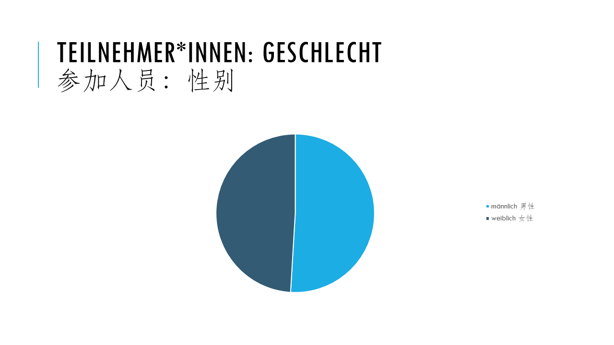
Es gab ein ausgewogenes Geschlechterverhältnis von nahezu 50% zu 50%. 

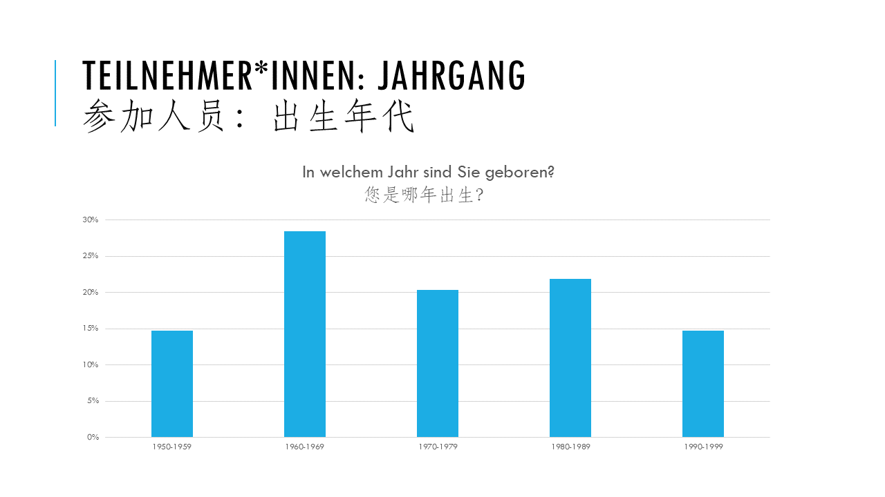
Die meisten der Umfrageteilnehmenden sind geboren in den 1960ern, aber auch die Jahrgänge der 1950er, und 1970er bis 1990er sind vertreten.

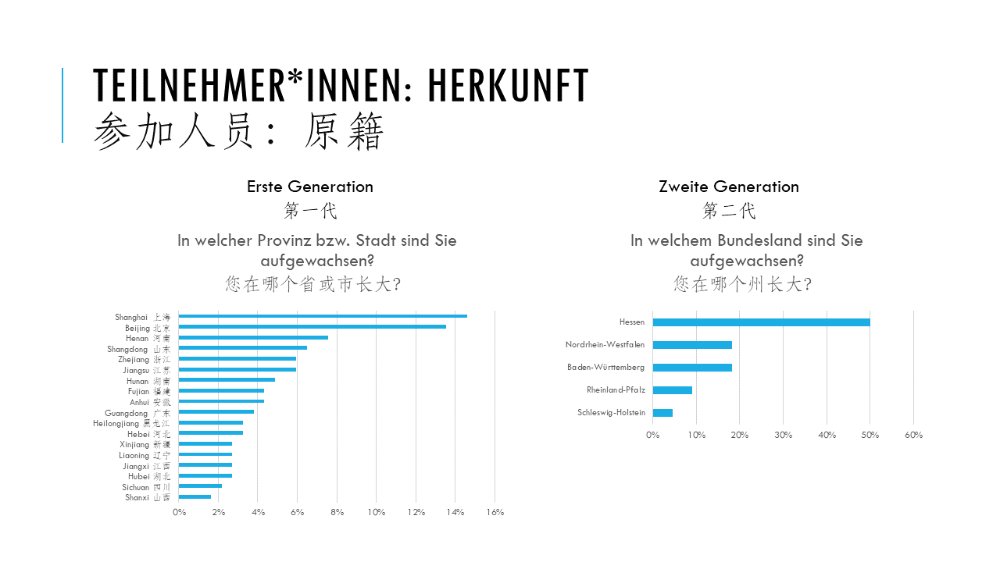
Die Teilnehmenden der 1. Generation kommen primär aus den zwei großen Städten Chinas, Beijing und Shanghai, wobei auch viele weitere Provinzen vertreten sind.

Bei der 2. Generation kommt die Hälfte aus Hessen. Dies ist der Tatsache geschuldet, dass diese Gruppe hauptsächlich aus meinem Freundeskreis besteht (der sich in und um Darmstadt befindet). 

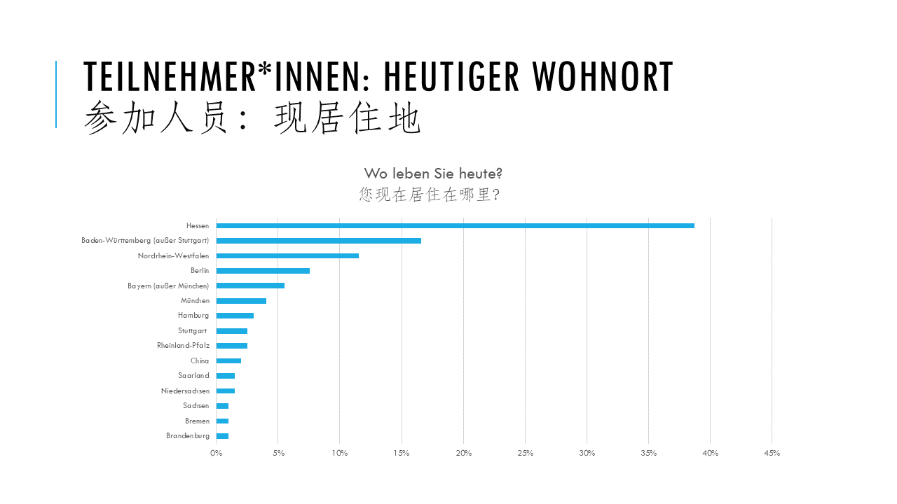
Fast 40% der Befragten wohnen jetzt in Hessen. Einige wohnen auch in Baden-Württemberg oder NRW. 

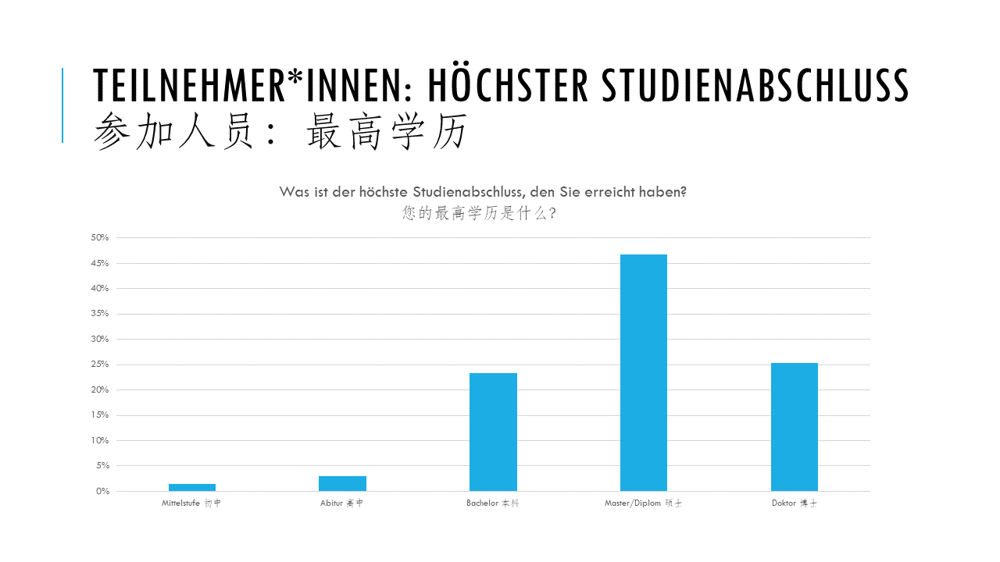
Es wird deutlich, dass die Umfrageteilnehmenden einen hohen Bildungsstand haben. Die meisten haben mindestens einen Universitätsabschluss,  knapp die Hälfte hat einen Master oder einen Diplomabschluss. Fast ein Viertel hat sogar einen Doktortitel. Die Gruppe der Umfrageteilnehmenden sind also überwiegend Akademiker:innen.

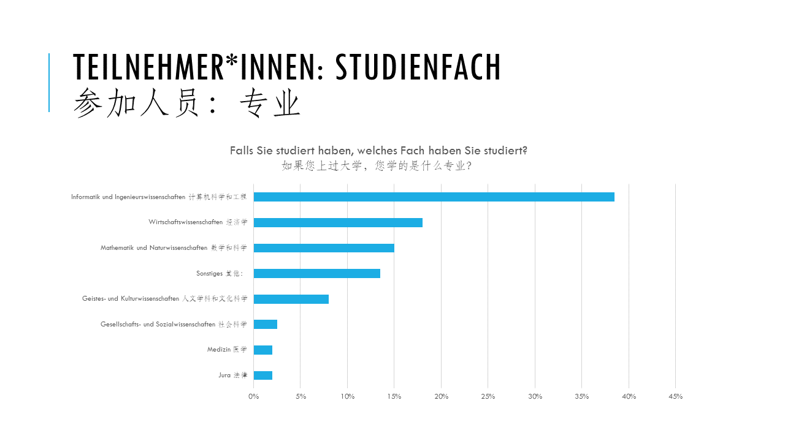
Die Studienfächer sind überwiegend Informatik und Ingenieurswissenschaften, gefolgt von Wirtschaftswissenschaften und Naturwissenschaften. Medizin und Jura folgen an letzter Stelle.

## Wahlverhalten

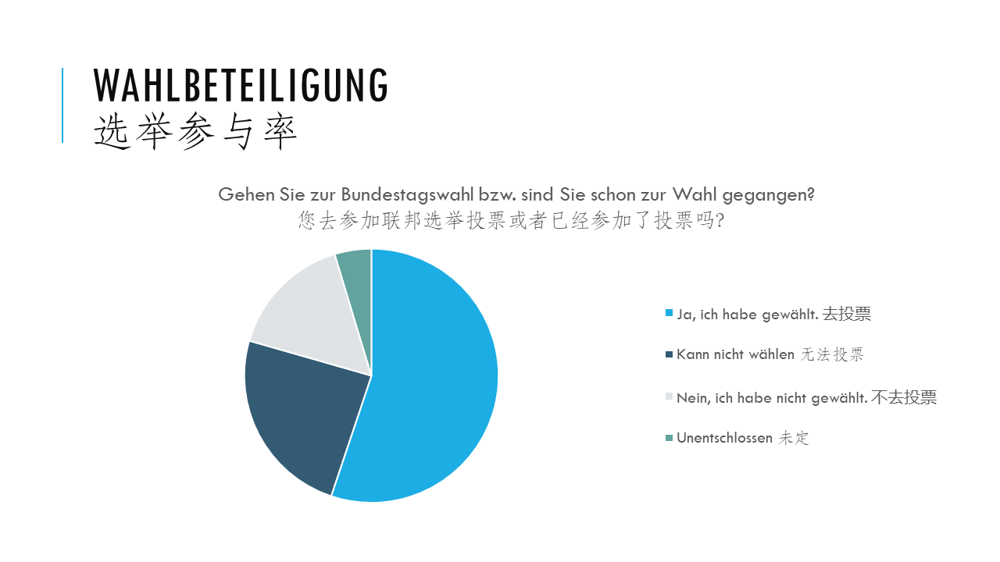
Mehr als die Hälfte der Umfrageteilnehmenden ist zur Bundestagswahl gegangen. Knapp ein Viertel der Befragten konnte nicht wählen (hätten es aber eventuell getan). Der Grund hierfür ist, dass ihnen die deutsche Staatsbürgerschaft fehlt.

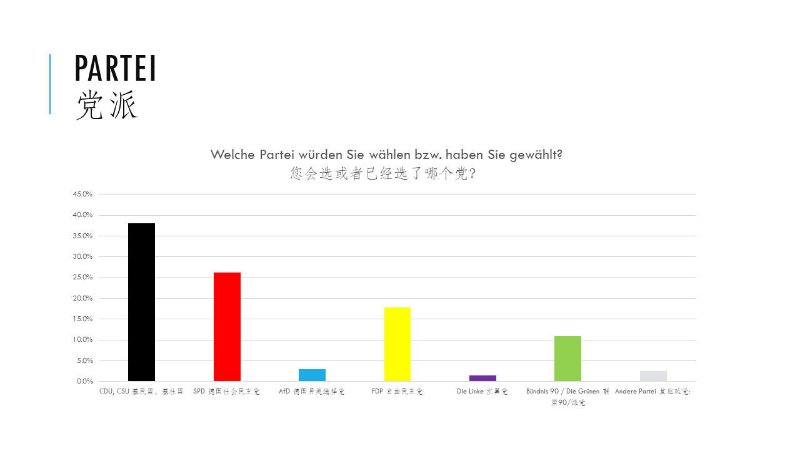
Die Befragten wählten zu ca. 38% CDU/CSU, knapp über 25% haben SPD gewählt. FDP liegt bei etwa 18% und Grüne bei knapp über 10%. 

Wenn es nach den Befragten der Umfrage ginge, so würden AfD und die Linke nicht in den deutschen Bundestag einziehen.

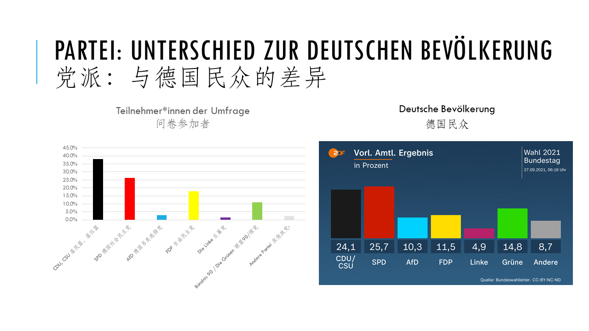
Wenn es um die bevorzugte Partei geht, so zeigen sich deutliche Unterschiede im Vergleich zur Gesamtbevölkerung in Deutschland. Menschen mit chinesischem Migrationshintergrund in Deutschland wählen lieber CDU/CSU und FDP als der deutsche Durchschnitt, dafür weniger Grüne und Randparteien wie AfD und die Linke. 

Grundsätzlich kann man sagen, dass die Befragten viel stärker Parteien der Mitte wählen.

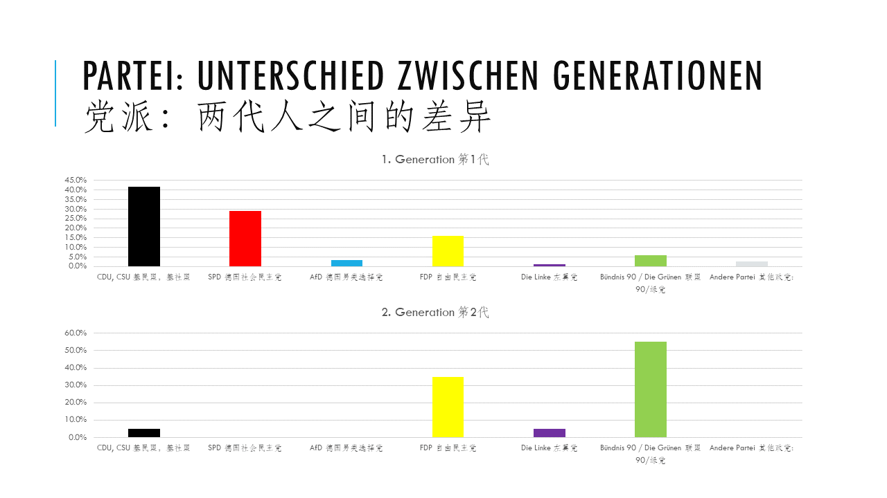
Schaut man sich den Unterschied zwischen der 1. und 2. Generation an, so zeichnet sich ein ähnliches Bild wie auch in der gesamtdeutschen Bevölkerung. Die jüngere Generation wählt vorwiegend grün und liberal, kaum jemand würde die CDU/CSU oder SPD wählen.

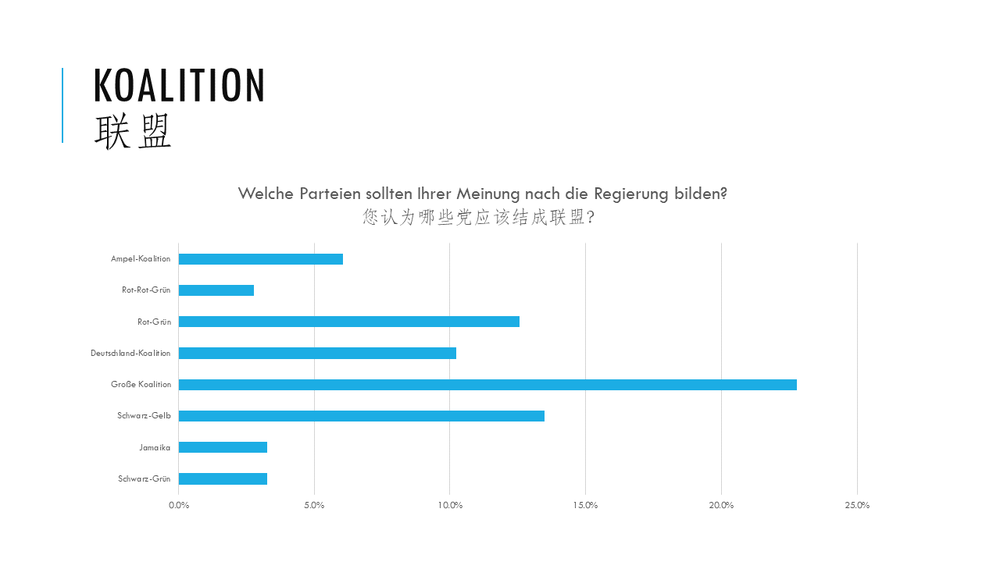
Fast 23% der Befragten würden sich eine Neuauflage der Großen Koalition für die nächste Bundesregierung wünschen, gefolgt von Schwarz-Gelb. Es wird also eine Regierung mit Beteiligung der CDU/CSU befürwortet. 

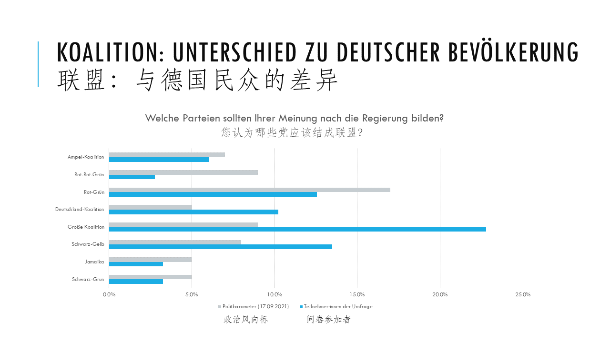
Vergleicht man die gewünschte Koalition mit der Präferenz der deutschen Bevölkerung allgemein, zeichnet sich ein deutlicher Unterschied ab: Gemäß der Umfrage des ZDF-Politbarometer würden sich die Deutschen viel eher eine Koalition aus SPD und Grünen wünschen. Die Große Koalition ist etwa genauso beliebt wie eine Rot-Rot-Grüne Regierung.

Die Ampel-Koalition, die nun die nächste Bundesregierung bilden wird, ist von keiner Gruppe besonders befürwortet worden. 

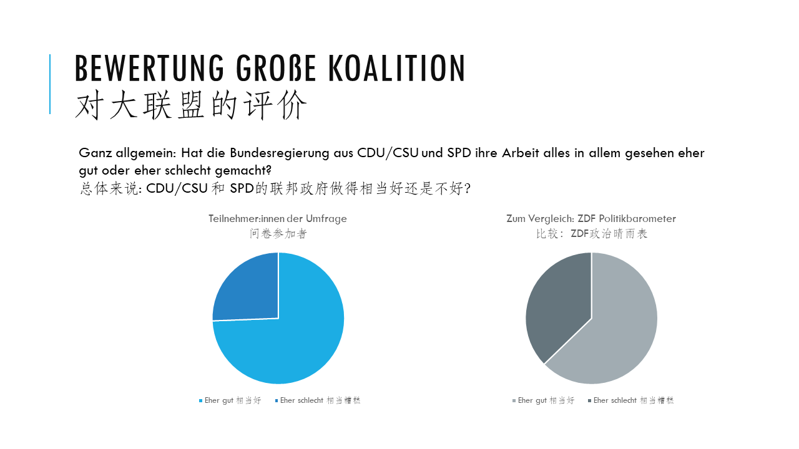
75% der Befragten finden, dass die letzte Bundesregierung ihre Arbeit eher gut gemacht hat. Das sind etwas mehr als der deutsche Durchschnitt. 

Dies deckt sich mit der vergangenen Frage zur Koalition. Personen mit chinesischem Migrationshintergrund scheinen zufriedener mit der Arbeit der Großen Koalition zu sein und befürworten eher einen Status quo. 

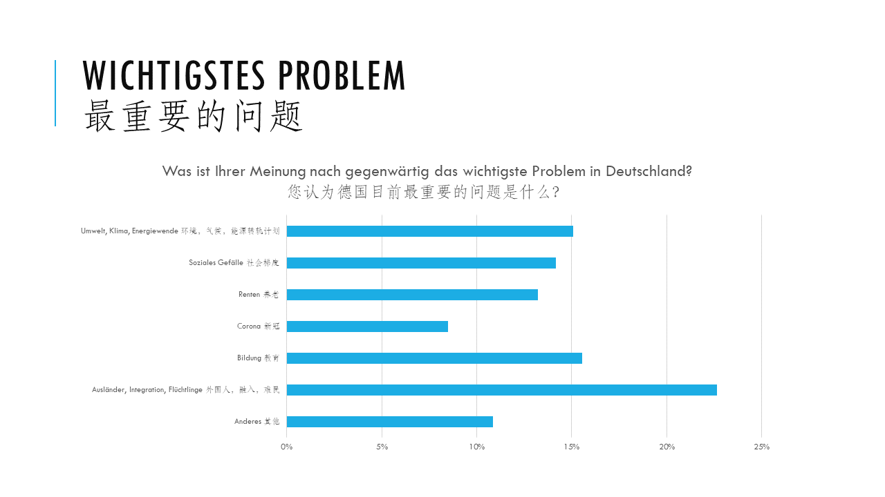
Als das wichtigste Problem in Deutschland sehen die Befragten das Gebiet von Migration und Ausländern. Auf Platz 2 ist das Thema Bildung, gefolgt von Umwelt, Klima und Energiewende.

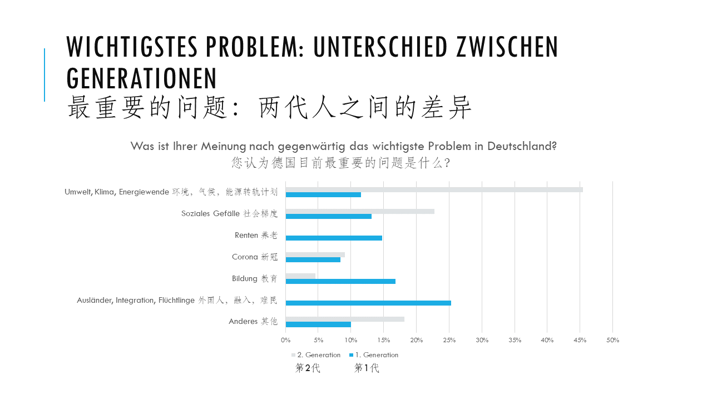
Auch bei der Frage des wichtigsten Problems in Deutschland gehen die Meinungen der Generationen auseinander. So finden Menschen der 2. Generation kaum, dass Ausländer und Migration ein Problem darstellt. Stattdessen sehen sie das Thema Umwelt, Klima und Energiewende als wichtigstes Problem in Deutschland.

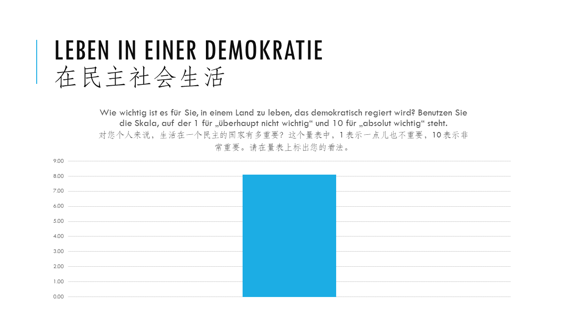
Mit einem Skalenwert von 8.1 lässt sich sagen, dass es den Befragten sehr wichtig ist, in einem Land zu leben, das demokratisch regiert wird. 

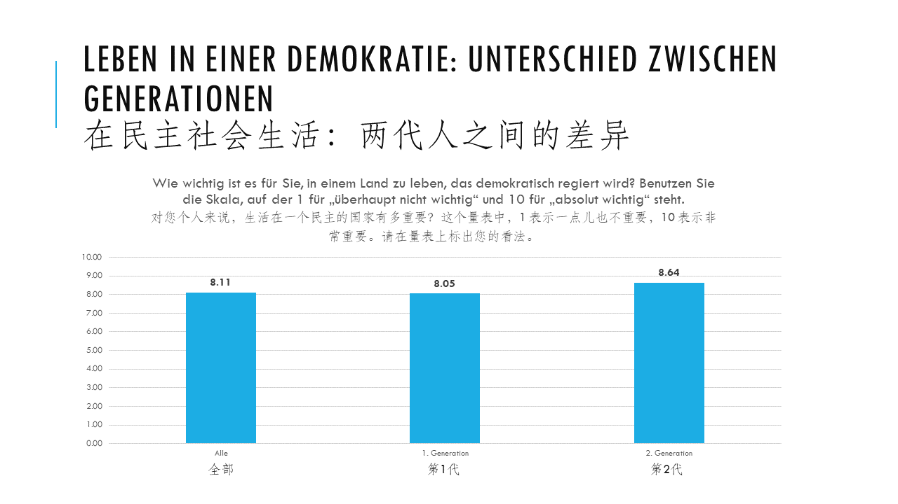
Im Vergleich der beiden Generationen macht sich ein subtiler Unterschied bemerkbar: Personen der 2. Generation empfinden es im Durchschnitt für noch wichtiger, in einer Demokratie zu leben, als Personen der 1. Generation.

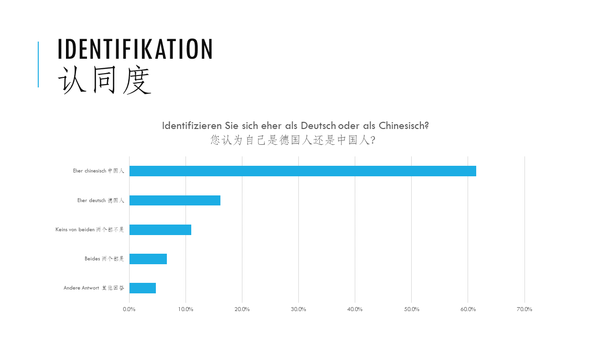
Überwiegend identifizieren sich die Befragten als eher chinesisch. 

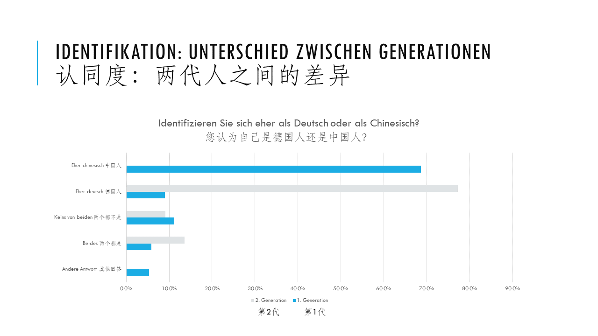
Wie zu erwarten identifiziert sich ein Großteil der 1.  Generation eher als chinesisch, während sich die meisten der 2. Generation eher als deutsch sieht. 

Bei beiden Gruppen gibt es aber auch Personen, die sich als beides, oder keines von beiden identifizieren würden. 

# Fazit

Alles in allem war dies ein sehr aufschlussreiches und interessantes Umfrageprojekt. Ich habe mich sehr über das Interesse von Teilnehmenden gefreut und hoffe, einen kleinen Einblick in die politischen Einstellungen von Menschen mit chinesischem Migrationshintergrund in Deutschland ermöglicht zu haben. 

Ich bedanke mich recht herzlich bei allen, die mich bei diesem Prozess unterstützt haben. Großes Dankeschön natürlich auch an alle, die an der Umfrage teilgenommen haben und zum Erwerb dieser wichtigen Daten beigetragen haben. 

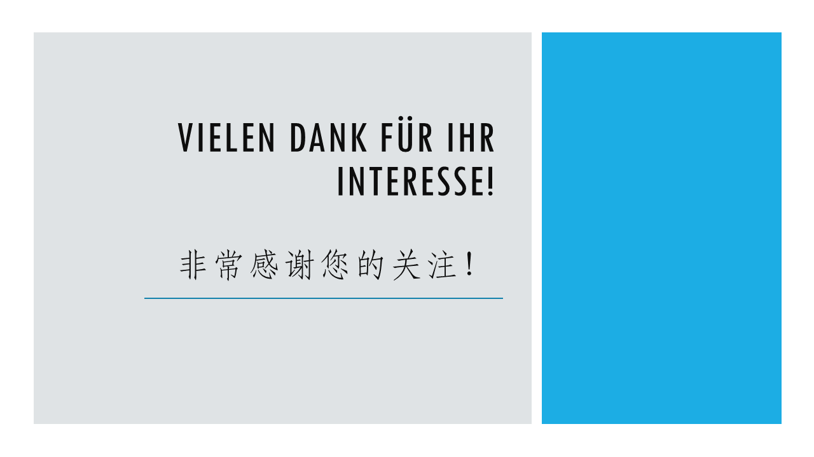

