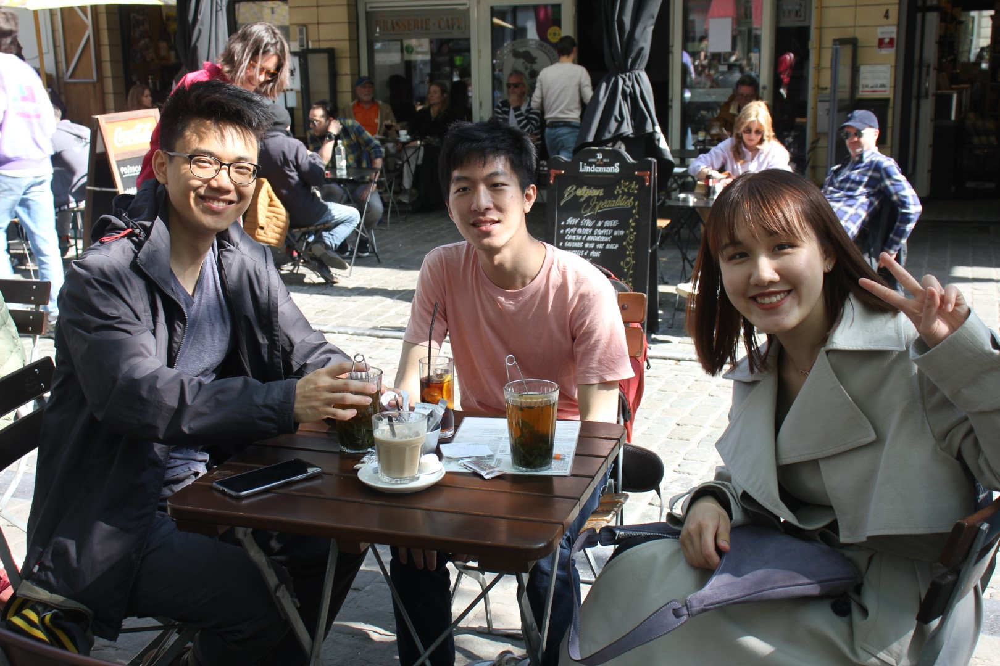

# Overview

After completing my [internship with the Green Growth Knowledge Partnership](https://www.celineli.com/2022/UNEP.html) in Geneva, I moved to a new role as a consultant. On this 3-month contract, I would work on an international high-level meeting, called "Stockholm+50", and support the coordination of side events. 

The [Stockholm+50 meeting](https://www.stockholm50.global/) took place under the slogan “A healthy planet for the prosperity of all - our responsibility, our opportunity”, 50 years after the 1972 UN Conference on the Human Environmen which was also held in Stockholm. Back then, conference was a pivotal moment for multilateral environmental action, giving birth to the UN Environment Programme. It is five decades later that world leaders once again had the chance to come together to reflect on the urgent actions needed to secure a healthy planet. Not just for us, but for future generations.

Side event took place on the margins of the conference itself. There were 50 side events, spread across 2 days. Me and one other colleague constituted the ‘Side Events Team’ from the UNEP side and it was our responsibility to select, plan and coordinate those events.

Both Zhenghong and myself have the luck that our work allowed us to be literally anywhere. Well, for me there was the constraint that I wanted to stay in the European Timezones (CET +/- 1 or 2 hours). My colleagues were sitting all over the world, one in NY, one in Nairobi, so it didn't really matter where I was. Also, we didn't really have an "office" into which I would have to go.

For the period of my contract, I decided to move out of Geneva, because a) it is very expensive to live there and b) I would come back in the fall anyway to commence my Master’s programme at the Graduate Institute. 

The question was then: _Where to go?_

I spent hours looking at the map of Europe, zooming in and out and in and out. “Europe is _so_ large”, I thought. I researched some “classic” digital nomad locations, like Croatia, Slovakia etc., but they didn’t really appeal to me at first because that would feel more like “tourist traveling”. They are places I hadn’t been to so I couldn’t really envision what it would be like. I was looking for something more familiar, conducive to working.

The decisions regarding destinations were made based on a combination of: “Where is it nice”, “Where did we find reasonably priced accommodation”, “Where do we have friends”... Plus, Zhenghong’s Schengen Visa (as a non-EU national) expired end of April, so that forced our hand to go to a place that is non-Schengen, and UK was the easiest choice.

In the end, the places I went to were:

- 31 May - 18 Apr: Brussels (via Lyon)
- 18 Apr - 24 Apr: Berlin
- 24 Apr - 7 May: Home in Darmstadt
- 7 May - 28 May: Oxford
- 30 May - 9 June: Stockholm (via The Hague)
- 9 May - 14 June: Berlin, then home

## Geneva

Started my journey here. Signed contract, had the first calls. Said a preliminary farewell to friends and colleagues there, though I knew I would be returning for my graduate study.

## Brussels

I liked Brussels a lot. Coming straight from Geneva, I felt that the cities were similar in some ways, and quite different in others. Starting with the similarities: Both cities are french-speaking, very international, home to international institutions. In Brussels, it’s European Institutions, in Geneva, it’s predominantly UN institutions. 

Where they differ, is the “vibe” of the cities. Brussels in my experience was more lively, there was more of a going out scene, and better food for less money. It was, however, less clean than Geneva and had not as much nature around. 

## Berlin

I was lucky to have been able to find temporary shelter at a friends’ flat, who was out for the week. I spent Monday evening to Friday noon there. My days were packed with work and play. Each morning, I woke up around 7am to talk to my supervisor since we had a hectic week at work. Then in the evening I would go out to meet friends for dinner and drinks.

I took part in a seminar on the weekend (it was the main reason I went to Berlin), which was socially rewarding but also added to the intensity of the week.

## Home

Home sweet home. Spending some time with my parents to chill a bit. De-accelerating my life. Not seeing many people. Making Jiaozi and baozi. Going on a jog in the morning and a walk in the evening. Nice life. Very calm and suburbian.

## Oxford

Good old Oxford. We felt pretty lucky to have found some temporary housing, which wasn’t easy to find in Oxford during exam season. Coming back as a working person, rather than as a student made me look at the city a bit differently. 

I realized how privileged we were as students to live in college accommodation, which was affordable yet close to the city center. This time, I lived in Jericho and got to appreciate a new neighborhood with lots of cafés, pubs and restaurants. I also started to feel how small and particular this place is, at least the university world. I'd bump into people on the street, hear students talking about their essays in “Week 1, 2, …” and would think to myself: Wow, it was great studying here but what a bubble it is!

At the same time, the places which were once so familiar to me have also moved on (I don’t recognize anyone in college anymore…). But I have changed too of course. I have seen more of the world and gained more confidence in what I do. Despite having had a really good study experience at Oxford, I am not really wishing it back. But I did enjoy being working adult and having some bursts of student experiences - for example, getting some cake from the Oxford German Society’s termly “Kaffee und Kuchen”, which I used to organize myself.

During weekends and after the workday, I met up with friends from various circles again: People I knew from studying PPE, people from my college, people from work, Germans I know from various scholarship groups, debating… On a social level, it has been really intense but rewarding. A lot of friends also came back for their graduation ceremonies, so I got to see them as well. Really a blast from the past!

During my time in Oxford, has been ramping up and becoming more and more intense. I tried to resist the urge to check my mails late at night (to prepare me for the next day) but often failed. I once tried to take a morning off and failed. Was learning to take care of myself. Weekends were busy from social activities, weekdays were busy from work - there was rarely a time to actually recharge…. Needed to learn to free myself of  thinking that not doing anything is like wasting my time. 

## Stockholm

Finally, I got to travel to Stockholm for the UN meeting! It was really exciting to see the side events, which I had spent so much time working on, come to life. I also saw some familiar faces again, for example Ben who was leading the GGKP and my previous team before I moved to the new role. He was the reason why I ended up being in Stockholm as he suggested me for the post. I also got to see Inger Andersen (Head of UNEP), the Secretary General of the UN (Antonio Guterres) and some other high-level folks. 

UN staff lived right next to the conference venue in a hotel, so that was very convenient. I woke up each morning, got some breakfast at the hotel buffet, then headed to the venue and got to work. We had to hand out conference badges, coordinate with the side event assistants in the individual rooms, liaise with organizers… Overall, the side events were a big success and we are very happy that they went by smoothly. 

After almost a week in Stockholm working, I stayed on for another few days to actually explore the city. Since the conference venue was very far away, I didn’t get to see much of the city whilst working. I walked through the old town, through the parks and explored the different islands on which Stockholm is located. Stockholm is really a city of islands, always surrounded by water. Very walkable, very pleasant.

Then, I finally went back to Germany, concluding 3 full months of hopping around.

**Key Takeaways on the Nomadic Lifestyle**

**- Accommodation is key.** Having a roof over your head is the most important thing. Finding accommodation is not straightforward: Landlords often prefer long-term rents, rather than a stay for just a few weeks. Airbnbs are an option, but they tend to be quite expensive.

**- You are still working.** In the end, I did have a very nice time in the places that I went to, but I could only explore them on the weekends or after the end of the work day. There wasn’t much time for proper traveling. So as nice as ‘digital nomad-ing’ sounds, it is still working, just in a different location

**- Having friends in a place makes it so much better.** For obvious reasons, seeing friends and having a social life contributes to one’s happiness. For these reasons, I am glad we got to go to places where we knew people already. Of course, a remote cottage in the mountains would have been nice as well, but it just wouldn’t have been as socially rewarding. I am very happy that I got to reconnect with so many friends all over Europe again.

Of course, living a digital nomad lifestyle like this also has disadvantages. It is exhausting to change a place constantly, you usually have to travel on the weekends, you need to build up a new routine each time, health and fitness habits get lost easily. Probably a more sustainable way of doing it would be to change places only once in a while, e.g. once every 2-3 months or longer, rather than every few weeks.

Partly because I am missing my routines, I am really looking forward to going back to *one* place after the summer, back to Geneva. But I did enjoy this time a lot and I felt it was a great blessing to reconnect with so many friends across those different places. I am grateful that my job allowed me to live this lifestyle for a few months. 