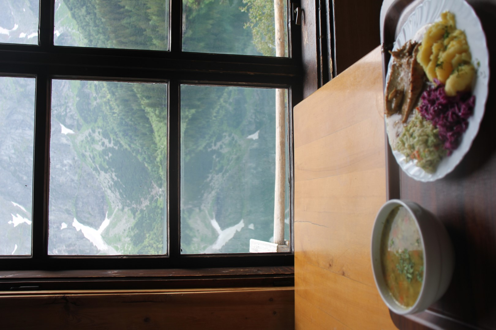
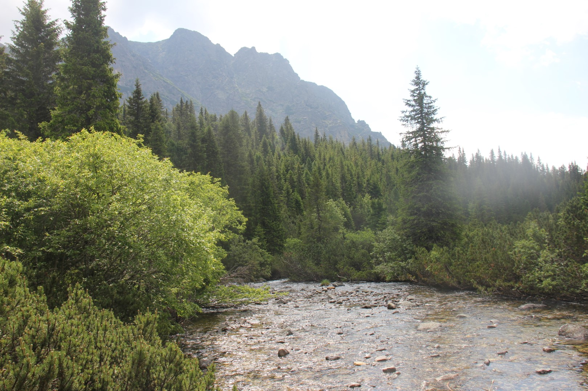

As part of my interrail trip through Central Europe in summer 2022, I completed my first multi-day, cross-country hike. It was a hiking trail that took me from the Polish side of the Tatra mountains to the Slovak side.

# Summary

The hiking trail leads over Poland's highest mountain peak, Mt. Rysy (2499m). It is a challenging hike leading over steep terrain and requires good physical condition. Must-haves include no fear of heights and proper hiking boots with ankle support, otherwise the risk of injury is high. Apart from that, no special equipment is strictly needed, however, walking sticks, gloves and possibly crampons for snowy bits could come in handy. End of June there was still snow on the mountain, so it may be better to go July-September.

The entire hike (as mapped out [here](https://www.google.com/maps/d/edit?mid=1dyjgNujPx6eh5Cv9SYw66_G2WshziN4&usp=sharing)) took me a total of three days. On average, I walked around 4 hours each day. I booked the mountain huts in advance, as they tend to be quite popular. Reservation months in advance is recommended, but I got lucky, despite booking only a week before. 

Morskie Oko mountain hut: [https://schroniskomorskieoko.pl/en/offer](https://schroniskomorskieoko.pl/en/offer); Hut under Mt. Rysy: [https://www.chatapodrysmi.com/](https://www.chatapodrysmi.com/). Both cannot be booked online, only by calling/sending a SMS. It is necessary to bring cash to buy food and pay for accommodation (Zloty in Poland, Euros in Slovakia). 

I had the most amazing time on this trail. It was the perfect balance between stunning views, diverse landscapes and a little adrenaline kick without compromising safety. Can highly recommend to all nature lovers!

## Day 1: Krakow - Morskie Oko

I came from Krakow, checked out of my hostel around 8am and took a Flixbus to Zakopane, a town south of Krakow. It is a common lodging place for people who want to explore the Polish side of the Tatras due to its convenient location. I merely transferred through though, and when I saw that it looked a lot like a very touristy place, I was glad to have skipped it. 

From Zakopane, I took a small bus to the beginning of the “hiking trail” to Morskie Oko, Palenica Białczańska. This 2h trail is not a hiking trail, it is an asphalt road with a lot of tourists and even horse carriages. The trail takes about 2h to reach Morskie Oko.

Morskie Oko is considered as one of the world's most beautiful lakes, and one can understand why. Clear water, a mountain backdrop and the reflection of the sun in good weather makes for a dreamy view. 

The "instagrammable" view of Morskie Oko:

The "real" view:

Due to the many tourists, I couldn’t really admire the lake’s beauty, so I decided to walk to the other side of the lake, where there were less people. I saw a little girl playing with pebbles along the shore, a very idyllic view I wanted to capture.

The check-in into the Morskie Oko mountain hut was smooth. They had a common sleeping room, and most beds were occupied by other hikers. There was a communal kitchen and bathroom with washing machine. Convenient for those who planned to do more hiking in the area. I only stayed one night though, so I just headed over to the restaurant and ordered some food to fuel me before the big day.

During dinner, I talked to the Mountain Rescue Team at the hut about the conditions of heading up the trail. They said the weather conditions in the morning were favorable, but there would be some storms in the afternoon. When he heard that I didn't bring a helmet, he said that I should start very early, because there is a lower risk of falling rocks from people further ahead. He mentioned “be careful” about 156 times. I decided to go as early as possible, at 5am.

I met a Polish couple, Damien and Karolina, who said they were going to head up to Rysy the next day as well. I was happy to hear that, since it is better to walk with someone (and they had already done the trail a few years back). 

To be honest, I had a lot of respect for the hike and prayed all would go well. My main concern was my heavy backpack, which weighed at least 20% of my own bodyweight, and was an extra strain on my feet and legs. I was scared my legs wouldn’t be able to carry it to the top. Writing those concerns into my journal that night, I went to bed at 9pm to get ready to climb the mountain the next morning.

**Total time**: 3h for bus rides, 2h for reaching the lake, 1h to go around the lake. 

**Total cost**: ~10€ for buses and park entry, 20€ for food, 9€ for one night accommodation in the mountain hut

## Day 2: Morskie Oko - Rysy - Chata Pod Rysami

Bright and early and with no one else around, I could finally admire Morskie Oko in the morning light without all the tourists. It was a beautiful sight. 

I met Damien and Karolina again, and we started off on the trail together. I had a quick pace in the beginning, when we were walking around the lake and realized I needed to slow down to save my energy especially when climbing up.

After about one hour we reached a second mountain lake, which is located a bit higher than Morskie Oko, which bears the name Czarny Staw (The Black Pond).

From here on, the ascent was relatively steep. This whole hiking path is quite “natural”, it consists of large rocks, with some gaps in between. Pretty easy to walk on with good hiking boots. Later on, the path got so rocky and steep that there were metal chains to help hikers pull themselves up. The walking stick I had borrowed from Damien in the beginning became more of a burden, so I strapped it to my backpack and used my hands instead to pull myself up the rocks.

Around 8am, some people already came down from the mountain and towards us. Whenever we encountered someone, we greeted them with the Polish word for "Hi", whcih is "cześć" (pronounced: cheh-sh-ch). The fact that those people were already coming down from the top meant that they started hiking at like 2-3am!

What was totally surprising was that I didn’t feel the weight of my backpack at all! Despite having to carry all my stuff to the other side, I felt light and energized. Perhaps it was just the breathtaking views and the mountain energy that kept me going. 

Before the clock hit noon, we made it to the top. The view on the two lakes on the Polish side from the peak was quite amazing - a perfect reward after a challenging hike.

The view to the Slovak side of the Tatra mountains wasn't too bad either.

I stayed a good while at the peak to admire the different landscapes. But the weather condition became visibly worse, as the Rescue Team had told me. When the clouds came, I began my ascent to the mountain hut, Chata Pod Rysmi (literally: Hut under Rysy).

A few hundred meters before I reached the mountain hut, it started to rain heavily. Luckily I was already close to the hut! But the last hurdle was a treacherous bit of snow that I had to pass. It was slippery, so I went down very carefully which meant I got quite wet. The best feeling of the day was then to step into the warm hut with a smell of hot food. Yay!

The very nice staff of the mountain hut showed me the sleeping room, which had around 15 beds inside. It was simple, but very comfy. My legs were super tired so I went straight to take a nap. 

To go to the toilet, we had to walk a small trail of 150m to the toilet, which was set at the edge of the mountain. The toilet was constructed with a glass window in the front, so whilst doing one’s business, one was able to admire the most stunning view! Can you spot the colorful toilet?

I spent the rest of the day staying around in the hut, having some food from the kitchen, chatting to the staff and other guests and playing games. I have so much respect for the team running this hut — all of the groceries, drinks, utensils etc. are carried on people’s backs up the mountain! Incredible.

There was no signal whatsoever in this hut, so it was good to disconnect for a while. I slept really well that night.

**Total time**: 5h to get to the top of Rysy, 1h more to get to Chata Pod Rysmi

**Total cost**: ~30€ for two meals at the mountain hut, 30€ for one night accommodation

## Day 3: Chata Pod Rysmi - Strbske Pleso

The final day of my three-day tour started off early again. My body had gotten used to waking up early. I had breakfast at 6.30am in the hut and then set off to take another peak of the mountains in the morning sun. I didn’t go all the way up to Rysy again, since I had seen it the day before, but I stayed a while in a nice spot with the dreamy mountain silhouettes. Then I made my way down.

The Slovak side of the trail is not as steep as the Polish side, but nevertheless challenging. There was one part where there were again chains and ladders to give hikers extra security on the path. 

Hikers came toward me, those who attempted to hike up Rysy from the Slovak side, and we greeted each other with "Ahoi", the Slovak word for "Hi". It sounded very cute.

What was immensely beautiful was how the vegetation layers changed, the more I went down. First it was barren rock, then it became this lush and green landscape with waterfalls and wildflowers, after which it turned into a dense forest, before I ended up in the nearest city, Strbske Pleso. From here, I took the train to Poprad, where I stayed the night. Here ended my hiking tour from Poland to Slovakia. 

Taking a last peak at the mountain from the other side:

**Total time**: 4h from Chata Pod Rysmi to Strbske Pleso

**Total cost**: 5€ for breakfast in the hut, 20€ for accommodation in Poprad

# Final Thoughts

Despite the initial touristy-ness of the trail, I was able to quickly get away into "pure nature" and enjoy some solitude in the mountains. It is has been a very rewarding and enjoyable experience on all fronts: It was a good physical challenge, I met some nice people along the way and understood more of Polish and Slovak culture, and the hike let me through some incredible wonders of Mother Nature. Couldn't asked for a better trip!

I got super lucky with the mountain hut reservations and the weather conditions, and I can recommend everyone who attempts this trail to do proper research before, make bookings and come with the necessary gear. 

Looking forward to my next trip to the mountains...