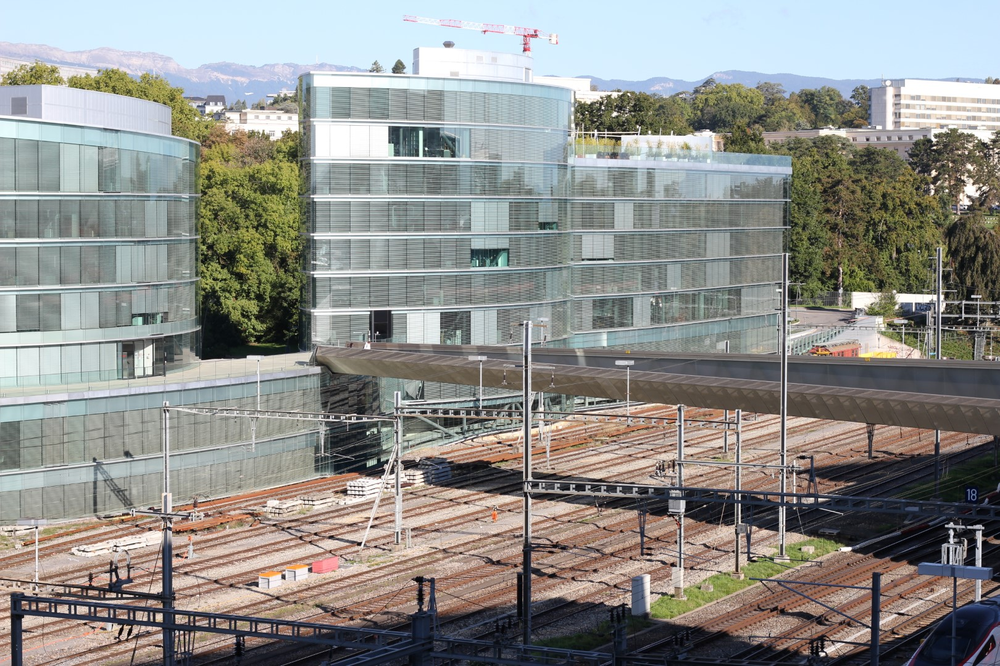
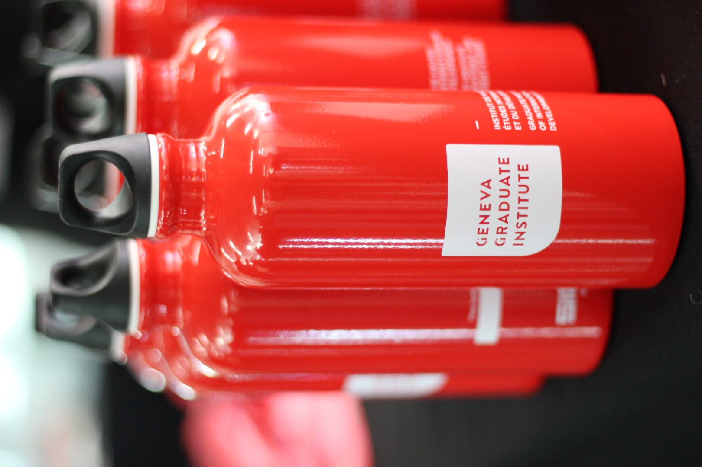
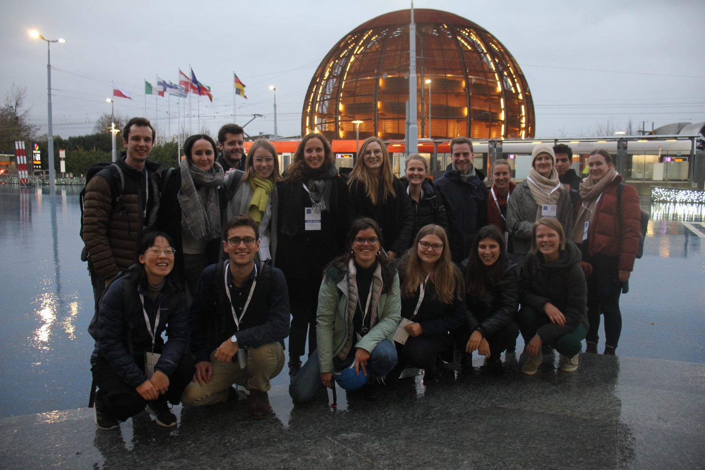
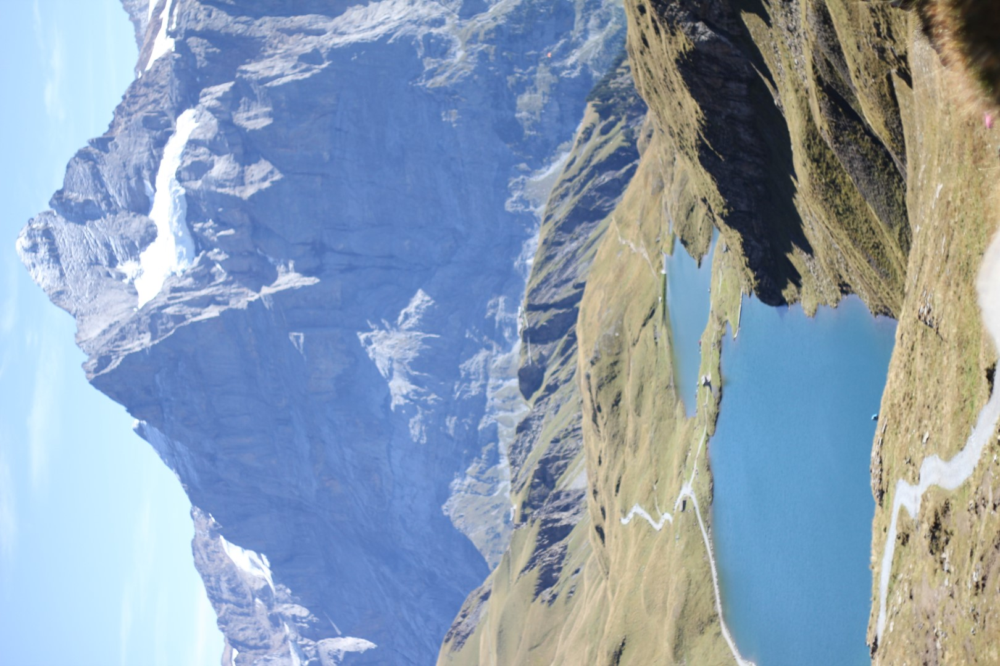

## Introduction

Taking two gap years between Bachelor’s and Master’s were a very good choice for me. I spent the two past years working in various internships, [being a consultant at the UN](https://www.celineli.com/2022/UNEP.html), and traveling. Now, I am back in Geneva for two years to obtain my [Master’s degree in Economics](https://www.graduateinstitute.ch/academic-departments/international-economics/our-master-programme) at the Graduate Institute in Geneva.

This was a very conscious choice. After working, I yearned to go back to academia. At the time I finished my degree in Oxford, I was somewhat tired of studying and wanted to explore the working world. With a degree as broad as PPE, I felt that it was important to explore and understand the different types of jobs I could do later. Now that I have done that, I am able to re-appreciate the academic life a lot more. 

Not only did I learn a lot about working in different types of organizations, about me as an employee, my strengths and weaknesses, but I also got to live and work in many places: Berlin, Munich, [Singapore](https://www.celineli.com/2021/Impressions-of-Singapore.html) and lately as a [Digital Nomad in Europe](https://www.celineli.com/2022/Digital-nomad.html). This meant that at some point, I had a very strong desire to have a routined life again, not to live “out of a backpack”, simply: to have a base. Of course, I have enjoyed the traveling, the mobility, but now I was also ready to feel rooted somewhere again.

Geneva has been a good choice. I knew the city already from having worked there during my internship at the UN. It was a natural choice to stay in a city I had already gotten to know and liked, so I applied to the Master’s programme of the renowned Graduate Institute Geneva.

With the first semester of my master’s programme done and dusted, I want to take a moment to reflect on my life in Geneva and the difference between the working and the student life.

## Academic Life

I always knew I wanted to do a Master’s. One part of it is that I felt PPE at Oxford was not “enough” — I had only scratched the surface of many subjects, but didn’t feel like I had an in-depth understanding of either of them. Another part is that a Master’s degree is simply necessary to have in the likely fields I want to work in later. And yet another part is: Learning is fun. Being a student is a privilege.

Over the course of my first semester as a Master’s student, I got to reappreciate *how* much of a privilege it is to be a student again. I love the liberty of determining my own schedule (apart from going to lectures, as how I structure my free time is up to me. This is very different from working: No one expects me to sit at a desk from 9am to 6pm). 

As students, we can spend hours and hours on understanding just one thing, a model, a theoretical concept, a paper (a downside of this is that because we have no fixed work times, we can easily work through weekends and not really “shut off”). At work, I had the impression that a lot was about *speed*. To produce results fast, I needed to be able to scan a lot of material very fast, do admin tasks quickly, and write well. Some of this is also important in academic life, but less so. 

### Master in International Economics at IHEID

The Graduate Institute (french name: Institut de hautes études internationales et du développement, IHEID for short) is a small university in the heart of International Geneva. It only offers 6 Master’s courses and a few PhD courses in International Affairs, History, Law, Politics, Anthropolocy and Economics. This means that cohorts are small and everyone knows each other. It’s a small bubble, which can be good for creating a cozy and familiar atmosphere but also bad as it feels a bit claustrophic at other times. 

The “Institute”, as it is often called, is proud to be very close to international organizations, as many of the professors are also practitioners or have close ties to organizations like WTO, UNHCR, UNCTAD etc., whose headquarters are just a few minutes away by foot. By right, the Institute is bilingual, and many of the staff are french- and english-speaking. In practice however, the courses are almost all exclusively taught in English and the number of Swiss students (which includes mainly students from the German and French-speaking part of Switzerland) is only at around 10%. 

The proximity to international organizations also means that the university’s teaching is, broadly speaking, applied and policy-oriented. I noticed this in my courses, where there has been a lot more emphasis on “intuition”, rather than getting the mathematical derivations right. It tries to strike a balance between equipping students with the technical expertise (mathematical rigor, familiarity economic models, proficient in using statistical software like STATA) and also the intuitive understanding that is needed to use economics in the policy world.

I am one of 24 Economics students this year. Our cohort is quite international and diverse and feels a bit like a school class. Students come from the US, China, Brazil, Nigeria, Uzbekistan, India, Italy, Armenia… The youngest is 21, and just finished her Bachelor’s degree, the oldest one is 36 and has been working in Finance for 10 years. Many have had prior work experience, and made the very conscious choice to go back to university to study. We are a very wholesome and collaborative cohort, which I am very grateful for. Everybody is sitting in the same boat and helping each other.

The course is structured as follows: In the first year, everyone takes the same compulsory courses Microeconomics, Macroeconomics, Econometrics (standard across most postgraduate degrees in Economics). Alongside these, we can specialize in certain tracks (Trade, International Finance, Sustainable Finance, Development Economics). The second year is reserved for exchange programmes, choosing more electives, and writing the Master’s thesis.

Personally, transitioning from working to studying wasn’t without its challenges. In Economics, we often need to do certain mathematical steps by hand, which requires taking derivations, multiplying matrices, manipulating equations… I had forgotten much of this stuff already. In fact, it was shocking to me just *how* much I have forgotten from my undergraduate degree! There just seemed  so much knowledge that had just evaporated from my mind during the time I wasn’t using it actively (Examples: How do I compute a confidence interval? How do I interpret a log-level regression model? What was the first Fundamental Theorem of Welfare Economics again? and much more…). What is more, I needed to get used to concentrating for a long stretch of time again,  because I was so used to multi-tasking at work. 

With time however, I got better at this again and smoothly transitioned back into the student life.

### Comparing UK vs. Swiss System

Coming from the UK, and more particularly the “Oxbridge” (Oxford and Cambridge) tutorial system, the academic life had a few novel (and welcome) changes for me. 

There is a professor for each course, and a Teaching Assistant. Professors give lectures, and TAs give “Review Sessions” based on this. In those, they go through applied exercises and supplementary material. Professors and TAs both offer office hours, which are “open door” times, where students can just come and ask any questions about the course material. In that sense, it is a little bit like a “mini-tutorial” that I knew from the Oxford system, a chance to speak the professor 1-to-1 and ask individualized questions.

Swiss grades go from 1 to 6, where 4 is a pass and 6 is the best grade (usually thought to be unattainable). It took me some time to get used to this as a German, since our middle school system gives grades also from 1-6, but 1 is the best grade and 6 is a big fail and you would never want to see that on your score. 

Final course grades are usually cumulative, and earned throughout the semester. For example, my grade in Macroeconomics was made up of: 2 x 15% problemset, solved as groupwork, 35% exam in the middle of the term, 35% a final exam at the end of the term. This is very different to the UK system, which was all based on *one* final set of exams at the end of one’s degree. It was a single set of three hours which determined my entire grade of the respective course. Hence, a lot more pressure on performing well on one given day.

Personally, I prefer the academic system in Switzerland over that in the UK, because it rewards perseverance across a longer time period over brialliance on a single day. 

## Living Costs

Geneva is a **very** expensive city for most people. This applies especially to rent, groceries and all kinds of services, like going out for food, getting a haircut, getting a bike fixed… Having said that, whilst the living costs are higher, the average Swiss salary is also very high. So if you work in Geneva, the living costs are perhaps not much of a concern. But for students it’s a different story. 

My rent in Geneva for a student dorm with private bathroom and shared kitchen and living space in a central location is 900CHF per month. In a student city in Germany, I would be able to rent a full apartment with that! 

Prices for groceries are around 30-50% more expensive from what I know from UK and Germany, but it is mainly the meats that are very expensive. Since I don’t buy meat myself, I avoid this extra cost. What many people also do is to take a bus to neighboring France (20 minutes) and buy their weekly groceries there.

In total, I would estimate my total living expenses (rent + groceries + travel + other stuff) to around 1500CHF. Tuition fees for the Graduate Institute are 8,000 CHF per year. Without a scholarship, I wouldn’t be able to finance my degree in Geneva, so I am immensely grateful that I received this opportunity.

## International vs. Local Geneva

Talking about Geneva, I have to mention how much of a “divided” city is actually is. There are two worlds which don’t mingle that much: The “International Geneva”, in which expats and people who work at international organizations meet and mingle. And then there is the “Local Geneva”, with people who actually come from the region and who are french-speaking.

Even geographically, it is possible to see the division. On the right side of the lake, all the international organizations are concentrated, and many expats also live there. On the left side of the lake, that is where more locals tend to hang out. It is quite a stark difference. 

Perhaps another reason why these two worlds don’t mingle that much is that in the International Geneva world, there is a lot of turnover: People come and go for a few years and then disappear again to somewhere else. They stay for 6 months for an internship, for 3 years for a consultancy, but then they leave again. Of course, some settle as well but it is certainly more common that expats don’t stay that long. This makes it hard to maintain long and meaninful friendships of course.

Being at the Graduate Institute, it is easy to never step outside of the international bubble. One big reason for this is of course the language barrier. To take part in activities with locals, one has to have a good command of French. But you can also easily live your life with just speaking English, and that sadly contributes further to this divide. 

## Social Life

I am lucky that my French is at a good level, enough to converse with locals and take part in such activities. So whilst my social life has been concentrated in the international part, and of course with the university, I also try to branch out and take part in non-IHEID related social activities. 

With my friend who is French native, we go to Improv theatre performances, and try to take part in the cultural life in Geneva as much as possible. 

I am part of the Choir of the local university (Université de Genève), and attend weekly dance classes in Lindy Hop. Both of these are fully taught in French, and I have already met some very nice people there. We haven’t done much outside of the choir practices/dance classes, but I’d like to change that. 

From the Carlo-Schmid-Programm (the reason why I came to Geneva in the first place), there is now a new cohort of Germans interning at various organiations, and I like to hang out with them. They are as energetic and enthusiastic about weekend activities as my own cohort, so we did activities ranging from hikes, visiting the CERN, dinner parties and Secret Santa.

At the university, I am happy to say that I found some very good friends. I don’t want to take this for granted at all. The small nature of the Institute means that it is very easy to meet people, but often that means you just meet them and say Hi on the hallway but not more. To really find *good friends*, that really stick with you, help you out when you are having difficulties, and that you will stay in contact with even after your mutual time in Geneva has ended, *that* is the challenge. 

I do hope that with the friends that I found (and in case you are reading this), I am happy you exist and that we found each other :).

## Nature

A big plus for me about living in Geneva is how close I am to beautiful nature. There is the Lac Léman, where all year around people go swimming (yes, also in freezing temperatures). There are the mountains nearby. In under 30 minutes, I can be at the foot of a mountain to start a hike. With a little bit more time (~2-3h), I can go into the Alps for hiking in higher altitudes or going skiing. 

*A hike near Interlaken, which I can reach from Geneva in around 2.5 hours.*

From the window of my room, I am able to see the Mont Blanc, Europe’s highest mountain. I see the surrounding mountains changing through different weather conditions and seasons. Everytime I wake up I just think “wow what a privilege to be so close to wonderful nature”.

## Food & Drink

What Geneva has in terms of proximity to nature, it lacks in a food scene. The Swiss are not exactly known for their culinary talent, to be fair. They do a good cheese fondue, which I can have once in a while, and of course chocolate. But other than that, there are not many traditional dishes that stand out to me. 

But also in general, there just isn’t that much good food around. If there is, it is not affordable. Going out for food means usually spending at least 15 to 20 CHF for one meal, not including drinks. For students, this is simply not in their budget. So unfortunately, one big aspect of social life, which is going out for food and drinks, is not that accessible in Geneva. 

## Summary

Overall, I am quite happy with life in Geneva. Being a student again is a lot of fun and I enjoy studying and learning in a stimulating environment very much.

Yes living in Geneva has its downsides (expensive, very expat-ty, “boring”). But these are not weighing as heavily for me (thanks to scholarship, thanks to being able to speaking French and access the “local bubble”). I am trying to carve out pockets of joy in the midst of a busy semester, connect with people I care about, and to broaden my horizon. 

Most likely Geneva won’t be the place for me forever, as I probably want to live somewhere where people don’t come and go for a few years all the time. But Geneva certainly has everything that grants me a very high quality of life, and that makes me filled with happiness and gratitude. If it is good now, it is good enough.