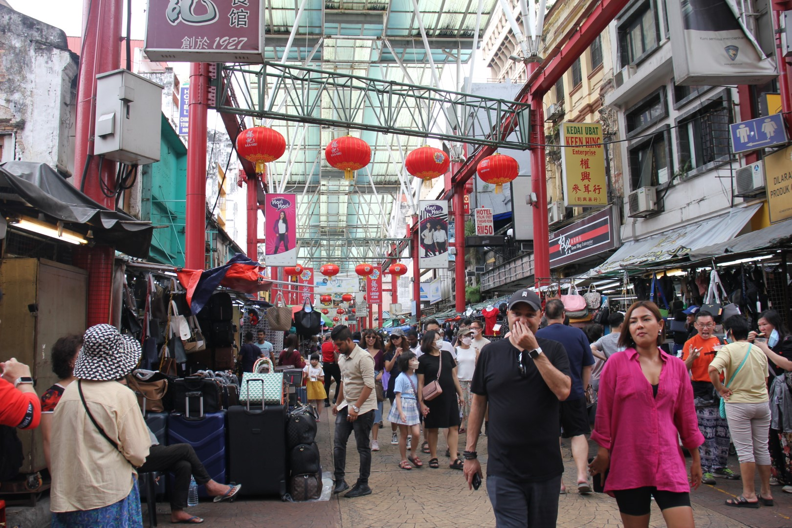

**Happy Lunar New Year of the Rabbit!**

In China, South Korea, Vietnam, Malaysia, Singapore and other countries, the turn of the calendar year is not the main event of the year. Instead, it is the *Lunar New Year*. This year, it was my first time celebrating it in an Asian context, in Kuala Lumpur, Malaysia’s capital city.

## Overview

Unlike New Years Eve, Lunar New Year is not a single day or event, but rather a festive period that lasts 15 days. Its dates vary each year and depend on the moon calendar, but is usually around late January or early February.

The significance of Lunar New Year, for those who celebrate it, can perhaps be remotely compared to Christmas in Western countries. It is a time when shops are closed, people to visit their families, exchange of gifts (in form of money envelopes), and of course, a time for consuming lots of tasty food.

*Hong Kong Style Dim Sum, which we had for brunch one day during the Chinese New Year period*

## Northern vs. Southern 北方和東方的差異

The Lunar New Year is celebrated across China, but traditions vary depending on the region. Broadly speaking, the Yangtze River divides China into the Northern (where my family comes from) and the Southern part.

In Northern China, we usually eat dumplings on New Year’s Eve, made from scratch of course. They represent little ancient silver ingots and symbolize wealth and good fortune. In some households you put a coin into one of the dumplings, and who gets that dumpling will be especially rich in the new year.

In Southern China on the other hand, traditional food for New Year’s Eve includes hot pot and fish.  Why fish? The saying 年年有餘 means that there will be “lots of surplus” in the coming year and the Chinese word for surplus (餘) is a homophone to the word for fish (魚). 

For me, Chinese New Year has always been a rather quiet event. We did not have extended family in Germany, so it was usually my parents and me making traditional Chinese dumplings (餃子) while watching the New Year’s programme on Chinese television. When I was living abroad in the UK and in Switzerland, I would gather my friends to make dumplings together, but it would be a rather lonely affair. All the more was I happy to know I could celebrate with my partner's maternal side of the family in Kuala Lumpur.

2023 would be the first year that I celebrated Chinese New Year in a “full” way, with family visits, red pockets, lots of food and everything else. 

## Chinese Malaysians 馬來西亞華人

Did you know that the second largest Chinese diaspora is in Malaysia? There are around 6.7 million people living in Malaysia who are of Han Chinese descent. Together, they make up almost one fourth of the entire Malaysian population. These Chinese Malaysians came to Malaysia mostly from Southern China in the 19th and 20th century and are mostly active in the business sector in Malaysia.

The family of my partner is Malaysian Chinese, many of them living in Kuala Lumpur, Melaka or Gulai (all in the Southern part of Malaysia). Even though they are already in the 3rd or 4th generation, they have preserved their Chinese heritage extremely well. This includes traditions as well as their languages. What I find incredibly impressive: The family’s cousins which grew up in Kuala Lumpur speak Mandarin, Cantonese, English and of course Malay. 

*Pictures in Chinatown*

## New Year’s Day 初一

On the first day of the new year, the whole family comes together, old and young generations alike. They sit together, eat some new year’s snacks and catch up on the latest news (work, children, etc.) of family members.

Because of the Cantonese influence, one of the traditional dishes served is [“Lo Sahng”](https://en.wikipedia.org/wiki/Yusheng), the Prosperity Toss. It’s a type of salad with fish and shredded vegetables, and the act of tossing is performed together as a family. Everyone gets together with their chopsticks and raises the salad into the air, shouting good luck wishes for the new year (hard to explain, at the end of the video here is an illustration: [https://www.youtube.com/watch?v=TQimojCAWkA](https://www.youtube.com/watch?v=TQimojCAWkA)).

*The whole family gathers to do the "Prosperity Toss"*

After taking family pictures, there are the red pockets. This is the act of handing out money envelopes (which are red). The rules of who gives money to whom are somewhat complicated, and also differ from family to family. The elders give money to the young, for example grandmother to grandson. When receiving the red pocket, the grandson is supposed to say some good luck wishes to their elder (e.g. “wishing you health and happiness”, “may all your plans work out”). But the young also give money to their parents, if they are already working and earn money. So if you are a child, then you only receive money. If you are an elder, you give money to everyone who is younger but you also receive from your children. I fell into the “young and unmarried” category, so was lucky to receive some pocket money 🙂

*The whole family*

Then in the evenings, people just hang around and snack on the New Year’s snacks (my favourite: small pineapple tart cookies) or gamble their newly won red pocket money away whilst playing Mahjong. 

## Conclusion

My first Chinese New Year in Asia was a very fun and insightful one. I learnt about the different traditions between North and South, and got authentic insights into the Chinese Malaysian diaspora. I find mix of languages especially fascinating (there were at least 3-4 languages spoken in the house at any given time). Now begins the Year of the Rabbit, which is my Chinese zodiac sign (What is yours? Find out here: [https://www.chinahighlights.com/travelguide/chinese-zodiac/](https://www.chinahighlights.com/travelguide/chinese-zodiac/)), so it promises to be a fateful year…