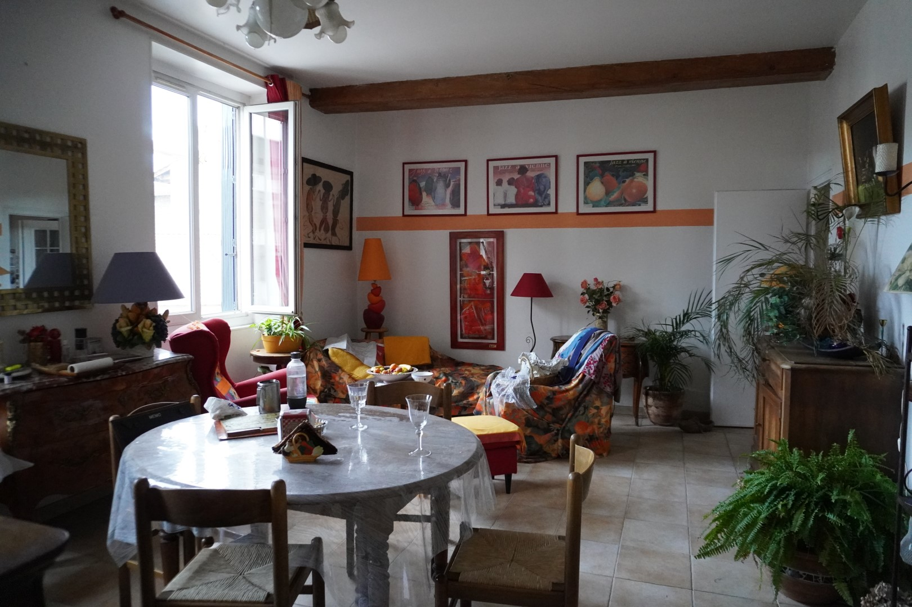
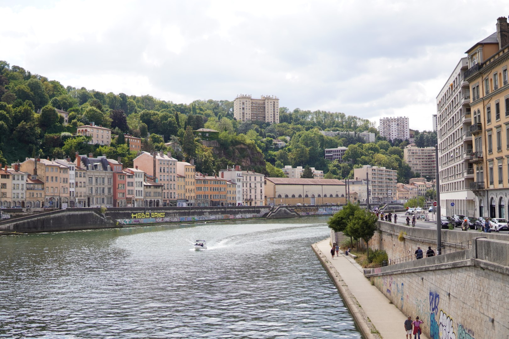
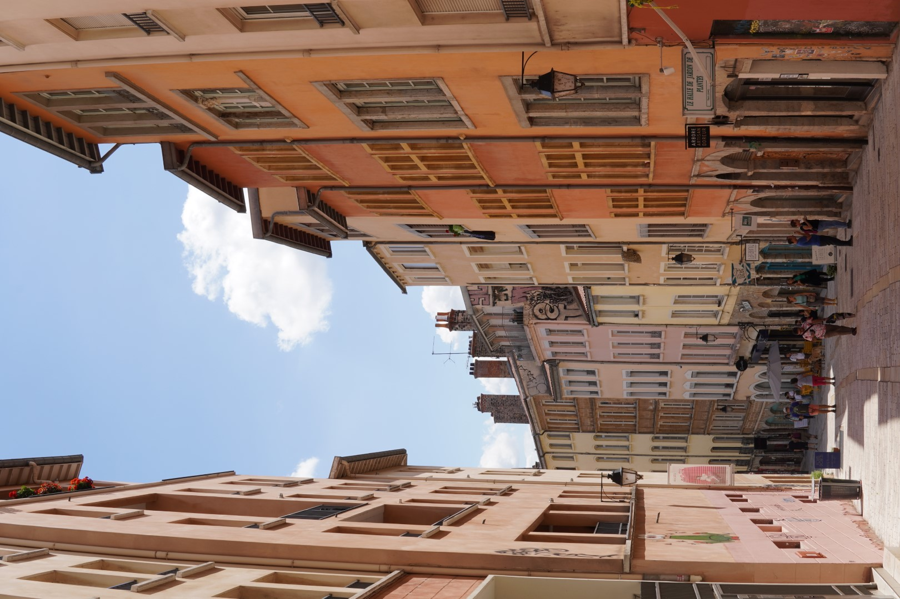
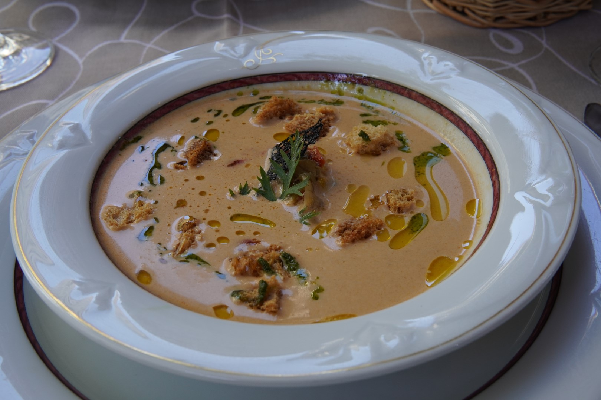
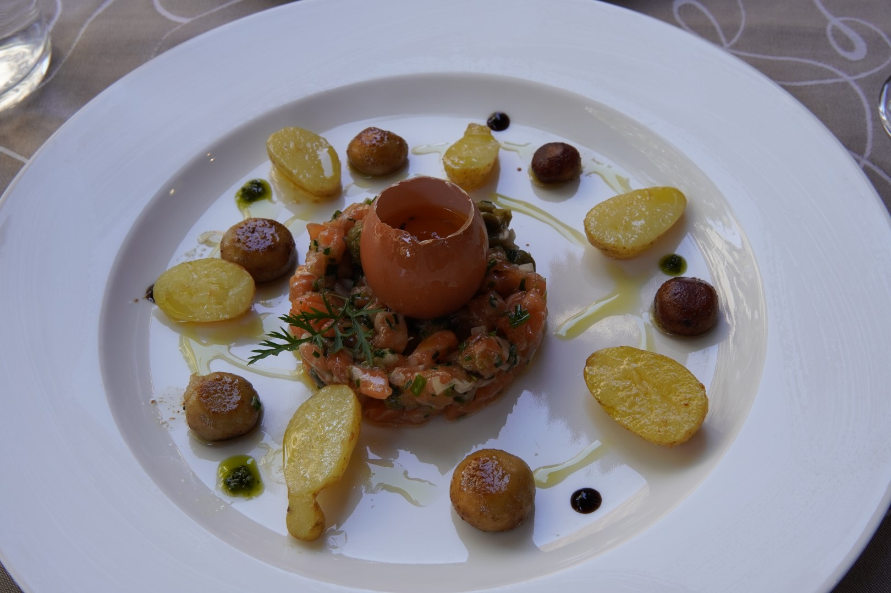
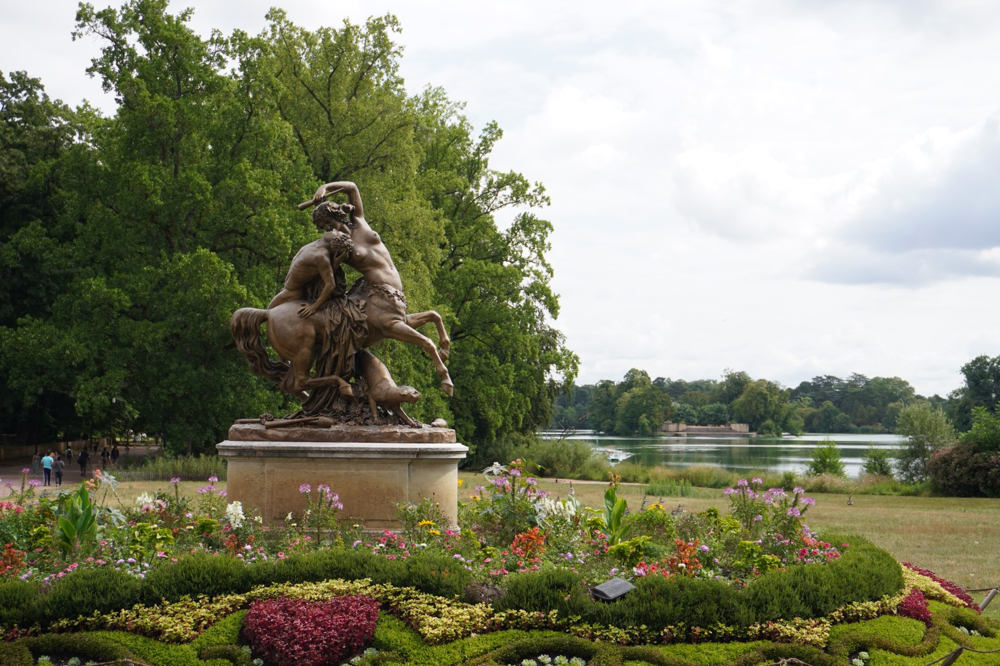
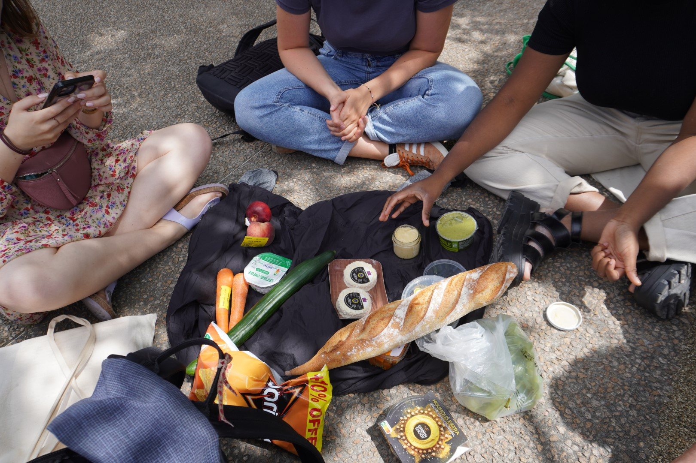

*English version below*

## Version française 

**Introduction**

Cet été, j'ai suivi un cours de langue à Lyon, la troisième plus grande ville de France. J'y suis resté trois semaines en participant à un cours à l'école "Alpadia". Chaque jour, nous avions trois heures de cours, suivies d'activités culturelles organisées par l'école, des explorations de la ville de Lyon et des petites excursions dans la région. Pendant mon séjour, j'ai vécu dans une famille d'accueil avec une autre fille, ma colocataire. Notre hôte était une femme célibataire de 69 ans sans enfants. Elle était extrêmement sympathique, et chaque jour, nous prenions le petit-déjeuner et le dîner ensemble.

*Le salon dans ma famille d'accueil*

J'ai eu la chance que ma place dans le cours ait été offerte et payée par la Fondation "Studienstiftung", une organisation en Allemagne qui accorde des bourses aux étudiants et organise des séminaires, des ateliers et des cours de langues. J'ai toujours eu le désir de suivre un cours de langue, car j'avais entendu dire que c'était une expérience très enrichissante. J'ai donc décidé de m'inscrire à ce cours, et à la fin du mois de juillet, j'ai préparé mes affaires et je me suis préparé pour cette petite aventure.

Mon objectif principal pour ce séjour était bien sûr d'améliorer mon français à l'oral, mais également à l'écrit. Grâce à six années de cours de français à l'école en Allemagne et à mes études d'un an à Genève, je suis capable de comprendre et de parler français dans la vie quotidienne. Cependant, une fois que j'aurai terminé mes études à Genève, il est probable que j'aurai besoin d'utiliser le français dans un contexte professionnel. Par conséquent, j'ai ressenti le besoin de pratiquer mon français à l'écrit et d'enrichir mon vocabulaire.

La ville de Lyon est magnifique, avec deux fleuves, le Rhône et la Saône, une vieille ville et un charmant quartier historique appelé "Croix Rousse", ainsi que de nombreux autres endroits agréables. J'ai eu l'impression que Lyon avait une taille humaine : en utilisant le métro ou même le vélo, il était possible d'atteindre tous les endroits importants en moins d'une demi-heure.

**La cuisine française et lyonnaise**

Personnellement, j'étais très intéressée par la cuisine et la gastronomie à Lyon, car la ville est réputée en France comme la "capitale gastronomique". Après trois semaines là-bas, je peux vous assurer que cette réputation est bien méritée ! Il y a de nombreux restaurants lyonnais traditionnels (appelés "bouchons") qui proposent de bons plats avec entrée et/ou dessert à un prix abordable. J'ai vraiment bien mangé pendant mes trois semaines à Lyon !

De plus, les Français adorent les marchés alimentaires, qui offrent des produits frais et moins chers. Les légumes, les fruits, les noix, les olives et les fromages sont excellents et bien meilleurs que ceux des supermarchés.

**Le cours de français**

Pendant mes trois semaines de cours, j'ai eu deux professeurs différents, tous deux compétents et sympathiques. La composition des étudiants dans la classe a changé régulièrement (certains arrivaient, d'autres partaient), mais en moyenne, il y avait de 8 à 10 étudiants chaque semaine. Les sujets abordés étaient les suivants :

- Grammaire :
    - Le subjonctif
    - Le discours indirect
    - Les temps du passé : l'imparfait, le passé composé, le plus-que-parfait
        - Le passé simple, qui est plutôt littéraire
    - Les temps du futur : futur proche, futur simple, futur antérieur
    - Les négations
- Vocabulaire :
    - L'éducation en France et dans le monde
    - La désinformation
    - L'histoire de la France
    - les trois registres du français: langage soutenu, langage courant et langage familier
    - Le tourisme et les voyages

La plupart des sujets grammaticaux me sont familiers, mais il s'agissait davantage de les réviser que de les apprendre à partir de zéro. Cela m'a aidé à consolider mes connaissances. Les cours se déroulaient du lundi au jeudi, et chaque vendredi, nous avions un petit examen pour évaluer notre niveau. À la fin, je suis ravie que mon professeur m'ait certifié au niveau B2, et que j'aie progressé vers le niveau C1 !

**La vie en ville**

Le programme du cours nous a laissé beaucoup de temps libre. Dès la fin des cours le matin, je sortais au restaurant avec des amis ou nous organisions des pique-niques au bord de la rivière. J'ai également profité des nombreuses activités en dehors des cours à Lyon, notamment les soirées de danse de Lindy Hop et de Salsa.

## English Version

**Introduction**

This summer, I attended a language course in Lyon, the third-largest city in France. I stayed there for three weeks, participating in a course at the "Alpadia" school. Each day, we had three hours of classes, followed by cultural activities organized by the school, explorations of Lyon's cityscape, and short excursions in the region. During my stay, I lived in a host family with another girl, my roommate. Our host was a 69-year-old single woman without children. She was extremely friendly, and we ate breakfast and dinner together every day.

I was fortunate that my place in the course was provided and paid for by the "Studienstiftung" Foundation, an organization in Germany that awards scholarships to students and arranges seminars, workshops, and language courses. I had always wanted to try out one of their language courses, as I had heard it to would be an extremely enriching experience. Hence, I enrolled in this course, and by the end of July, I packed my bags and prepared myself for this little adventure.

My primary goal for this stay was, of course, to improve my French, both in speaking but more so in writing. With six years of French classes in German schools and a year of studying in Geneva, I can comprehend and communicate in French in everyday situations. However, once I finish my studies in Geneva, it's likely that I will need to use French in a professional context. Therefore, I felt the need to practice writing in French and enhance my vocabulary.

Lyon is a beautiful city, adorned with two rivers, the Rhône and the Saône, an old town, and a charming historic district called "Croix Rousse," among other pleasant spots. I got the impression that Lyon is still very human-scale: With metro or the bike, it was possible to reach all important locations in less than half an hour.

**French and Lyonnaise Cuisine**

Personally, I was deeply interested in Lyon's cuisine and gastronomy, as the city is renowned as the "gastronomic capital" of France. After three weeks there, I can assure you that this reputation is well-deserved! There are numerous traditional Lyonnais restaurants (known as "bouchons") that offer great dishes with appetizers and/or desserts at an affordable price. I thoroughly enjoyed the food during my three weeks in Lyon!

Moreover, the French love food markets, which provide fresh and more affordable products. Vegetables, fruits, nuts, olives, and cheeses are excellent and much better than those found in supermarkets.

**French Course**

During my three-week course, I had two different teachers, both of them competent and friendly. The students in the class changed regularly (some arrived, others left), but on average, there were 8 to 10 students each week. The topics we covered included:

- Grammar:
    - The subjunctive mood
    - Indirect speech
    - Past tenses: imperfect, passé composé, plus-que-parfait
        - The passé simple, which is more literary
    - Future tenses: near future, simple future, future perfect
    - Negations
- Vocabulary:
    - Education in France and around the world
    - Disinformation
    - History of France
    - The three registers of French: formal language, everyday language, and informal language
    - Tourism and travel

Most of the grammar topics were familiar to me, but it was more about revising them than starting from scratch. This helped me solidify my knowledge. Classes took place from Monday to Thursday, and every Friday we had a small exam to assess our level. At the end, I was very happy to see that my teacher certified me to have completed B2 level and that I am now progressing toward the C1 level!

**Life in the City**

The course's schedule left us with plenty of free time. As soon as the morning classes ended, I went out to eat with friends or organized picnics by the river. I also took advantage of the numerous extracurricular activities in Lyon, including Lindy Hop and Salsa dance evenings.

