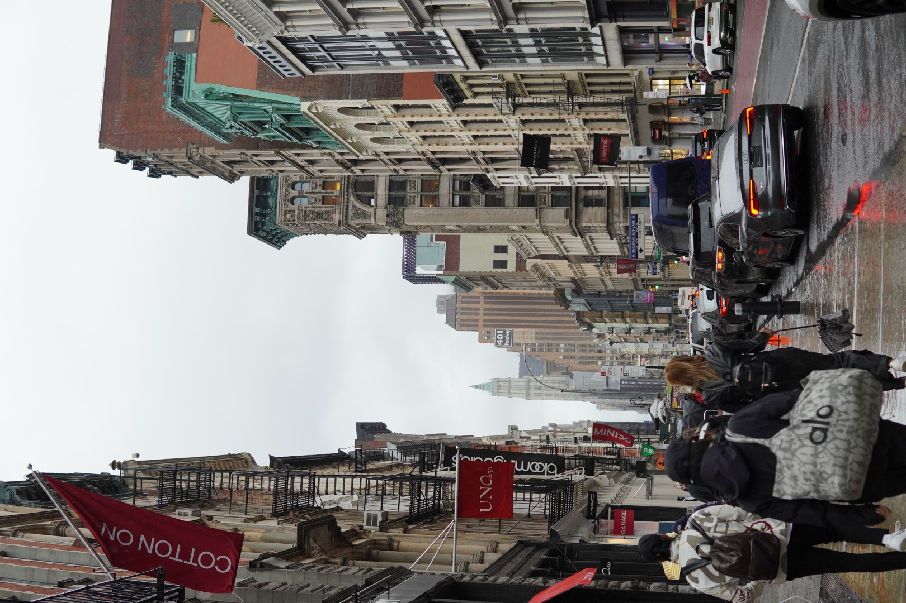

As part of my Master’s degree in International Economics at the Geneva Graduate Institute, I spent one exchange semester at Yale University in the fall term of 2023. Looking back at the richness, personal growth and learnings of the last few months, I feel deeply grateful and fulfilled for having had this opportunity. 

What follows are impressions of my 4-month long taste of an American Ivy.

*The Yale Sterling Memorial Library*

## Motivation

Why did I choose to do this exchange in the first place? I was quite happy to have stayed in Geneva for my [Master's in Economics](https://www.celineli.com/2023/Masters-first-year.html) after having come to the city for my [work at the UN](http://www.celineli.com/2022/UNEP.html). I felt that I had reached at a point where I knew Geneva quite well, had a great base of friends, but was also curious about another adventure. So, when in early 2023 the deadline for applying for an outgoing exchange rolled around, a part of me wanted to give it a try. 

I therefore asked myself: What is it that I seek from an exchange that I can otherwise not get at my school in Geneva? Whilst I appreciated the more policy-oriented teaching at the Geneva Graduate Institute - a reason I chose this school for - I missed at times more academic rigor in my courses as well as the students demanding it. I knew that in order to learn and grow more, I cannot be the person in the classroom asking the most questions. This is what attracted my about Yale (and its excellent reputation of course). Plus, I had never been to the United States and wanted to experience it for once, without actually having to commit to work there for longer. 

So, I ended up applying to the exchange program and luckily secured the spot. What followed were arduous months of preparing the paperwork, applying for the visa, securing accommodation and then finally: boarding the flight to John F. Kennedy airport in New York City.

## New Haven

Yale University is located in the city of New Haven, which is in the state of Connecticut on the U.S. East Coast. It is a middle-sized city, with around 140,000 habitants, but it feels very much like a small city or perhaps even suburb. Due to a very high share of Italian immigrants, New Haven is known for its local pizza, which to be honest I never got the hype around. With 2 hours of a train journey into each direction, New Haven is very close to large cities like New York City or Boston.

The university dominates life in and around the city and is the biggest employer. I was told that they did not have to pay taxes to the city as it is an “educational institution” which seems to contribute to quite a “Town vs. Gown” divide. This can certainly be seen in the city landscape: The centrally-located Yale Campus is old, polished, and beautiful, but neighborhoods outside of it start looking a little bit more rundown and less manicured. 

A not-so-pleasing aspect about living in the US, and especially New Haven, was that for the first time in my life, I had to think about my personal safety when walking around the city at night. There were warnings, especially at the beginning, to not venture alone (especially as a women) in certain areas downtown, and preferably to stay in groups or take shuttles or taxis back home. It didn’t help that we would receive emails every time a shooting or robbery occurred near Campus from Yale’s own policy force (the fact that a university has its own policy force is just ??) Personally, I think that some of this was overstated, and it only increased the perceived fear which may not have been grounded in reality. After a few weeks, and also after getting a bike, I got a lot more comfortable moving around the city and as long as you are being mindful and exercise appropriate caution.

*Inside of Branford College, one of 14 colleges which are mirrorred after Oxford and Cambridge's college system*

## Academics

I came to Yale mainly because of the academics, and found that my expectations about Yale’s Economics faculty were fully met, and more. Being a graduate student meant that everything was more geared towards research. 

I also had a clear goal in mind, namely that I wanted to develop the research question for my Master’s dissertation and the appropriate data to answer it. I knew that with the excellent faculty, peers and courses, I would be able to have productive exchanges that could propel me forward. So I wanted to seize those opportunities as much as possible. 

Thus, a guiding theme throughout my exchange was how I needed to learn switching my mindset from a mere “*consumer* of research” (meaning: reading through textbooks, understanding concepts, reproducing them in an exam, solving problemsets) to a “producer of research” (critically evaluating research designs, identifying gaps in the literature, asking relevant questions, finding data to answer those questions…). It was through the exchanges in my courses and outside of them that I was able to slowly get an idea of what the life of a researcher looks like. 

*The Department of Economics on 28 Hillhouse Avenue*

### Courses

As an exchange student, I had great liberties in choosing my courses. I simply needed to fulas a city qfil the requirement of 4 graduate-level courses (which equates to 30 credits at my home universities) and they have to be Economics-related enough so that they can count towards my degree. I wanted to complement my foundational courses from the first year (Microeconomics, Macroeconomics, Econometrics) with specialized field courses in my areas of interest, but also have a good mix between theory, practice, and interdisciplinary courses.

After an initial “shopping period”, where I attended a number of different courses to choose the right ones for me, I settled for the following ones:

**Urban and Environmental Economics:** A PhD-level field course, usually for 2nd and 3rd years that introduces a number of “urban economics” and “environmental economics” topics. Taught by two professors, each taking one half of the course. It was assessed through a 3-page referee report about a working paper, highlighting its strengths and weaknesses and a 10-15 page research proposal, which I made about my Master’s dissertation. This course taught me how to critically evaluate research designs, and the economic stories and narratives that underpin them. This is especially relevant for policy design. 

**Applied Quantitative Research Design:** A methods course for causal inference in the social sciences, addressed to a broad audience from undergraduate students to PhD students who want to get more hands-on practice with the statistical computing software R. We had weekly problemsets assigned, which required coding in R and a final data project of 8-10 pages. Through this course, I learnt some helpful commands and workflow strategies for doing data analysis in R, got hands-on experience with coding up my own project, and also began to understand that data stuff always takes a lot longer than you think.

**Seminar in Environmental and Natural Resource Economics:** A seminar which invited different guest speakers each week to talk about working-paper-stage research and offered opportunities to meet 1-to-1 with the speakers. It covered a broad range of topics: From the effect of air pollution on economic opportunity, natural capital, over to noise pollution’s impact on whales in the Pacific Ocean. The best thing about this course was the access to the speakers, as they usually traveled to New Haven for at least a day so we could sign up for office hours or lunches with them. I benefited from my personal exchanges with the speakers, who shared research-related or meta-advice about doing good research.

**China’s Challenge to the Global Economic Order:** A public policy course taught by a retired US diplomat who served as Consul General in Hongkong and Shanghai. Using his extensive network from his career in the Foreign Service, this course was primarily based on guest speaker lectures (US diplomats, Chinese and Taiwanese officials) and contemporary readings about China. One of the things I’ll vividly remember was a class debate about whether China should have entered the WTO in 2001, where we had to represent argument in favor and against, putting ourselves into the shoes of US members of congress at the time. In this course, I got to understand the US foreign policy on China much better, and gained knowledge about a broad range of actors in the field. 

### Research Community

Being a large university with lots of resources, it is not surprising that Yale has a thriving research community. In the Economics department, each *day* alone there are multiple research talks taking place in pretty much all fields of Economics: Trade, Development, Macro, Micro(-Theory), Econometrics, Economic History, Finance... I regularly attended the lunch talks in the development economics and trade sequence where advanced PhD students presented their research, as well as the Leitner Political Economy series by the Political Sciences department. 

There was something very “American” and “Ivy” about the lunch talks: Given that we all have to eat, and we want to give more people the chance to get feedback on their research, why not combine the two. At first I found it a bit awkward that a PhD student would present their past year’s work to a smacking audience devouring into some sandwiches but I guess you got used to it. A whole new meaning of the “working lunch”. 

Students would sit in the backrows, silently eating, while professors sit in the front rows and start asking questions from the very first slide onwards. I was always quite impressed how quickly the faculty members would be able to identify the main weaknesses of a project and pin the student down on that. Critical feedback was welcomed, and everyone had an interest in making the presenter’s work better, a great collaborative effort.

Aside from that, there were also research breakfasts, which were more informal opportunities to discuss research ideas and afternoon talks. Having this community around was truly very conducive for learning and improving on one’s ideas.

I myself have benefited a lot from being in this environment. My peer group were mostly PhD students who were more advanced in their research, and talking to them has taught me a great deal about finding my own interests, designing a good research question, doing preliminary data checks, how to set up a good coding workflow… These are essential research skills that weren’t really taught in my first year in Geneva because we were so focused on content.

But this process wasn’t without hick-ups. I think that being a researcher takes a lot from you, because your scholarly self is deeply intertwined with, well, your*self*. And that means knowing and having clarity about, your personal interests. What am I interested in? What do I want to spend my time doing? - these questions were important to ask myself but also triggered a lot of existential questions, which I plan to exploring further. I also needed to overcome feelings of self-doubt, impostor syndrome and a fixed (instead of growth) mindset whenever I felt really down and without direction.

## Social Life

At Yale, there was never a shortage of social events to attend and interesting people to meet. If you are reading this, chances are that you know me, and so you know that I like going to social events, mingle with people, and you can bet that I did that to the fullest extent possible in my semester as well. I think having the “scarcity” mindset helped me in being intentional with my time and explore as much as possible - libraries, cafés, events, different social groups etc. 

Knowing my limited amount of time, I approached socializing at Yale semi-intuitively following the principle “Explore & Exploit” for meeting new people. At the start, it was all about **exploration**: Go to all the events, academic and otherwise, and see who’s there. Be very open, say yes to everything, etc. This was a thrilling, but also exhausting time. After this, I followed more a principle of **exploitation**: Not exploiting in the negative sense, but once I felt like I had met a fair share of people that I saw potential for deeper connections, I tried to focus my time on that. I didn’t want to go to random social events anymore but rather spend quality time with friends.

Going into the exchange however, I thought about the prospect that it might be hard to form deep friendships and connections, given that people could perceive me as a “transitory” person who isn’t worth investing their time into. Fortunately, I was proven wrong. I have felt extremely welcomed and blessed in the student community and am lucky to now call a number of people my good friends. 

*Social Activities Fair in the Yale Schwarzman Center Common Hall*

## Travel

On the weekends, during the mid-term break and the thanksgiving break, I got to travel a fair bit around the East Coast. This is the part of the US that is still OK-ish to travel in without a car, as the train network is relatively developed. 

### Boston

Went here for two weekends, each time for conferences. Boston seems like a smaller New York, with lots to do but less travel times. Cambridge, which is located across the Charles River and home to Harvard and M.I.T. is a smaller town with a lot more students and faculty. 

*Boston City Centre*

*Harvard Campus*

### Toronto

Visited friends from my undergraduate program at Oxford, did a lot of catching up, had nice food in Toronto Downtown but also in the outskirts.

*At Toronto's Graffity Alley*

*Toronto Chinatown View on CN Tower*

*From Toronto Islands, just off the shore of the mainland*

### Washington D.C.

Came here for Thanksgiving break and mainly spent it in libraries and universities because I had to work. But got an exclusive West Wing Tour which was neat! D.C. is a relatively clean and orderly city, streets are structured alphabetically and numbered, hard to get lost in this city.

*View on the Capitol from the Johns Hopkins School of Advanced International Studies building*

*Press Conference Room in the White House*

*The White House*

### New York City

*The* iconic city does not merit any introduction. What surprised me the most about New York was how much of it was so familiar to me already from movies and series that play in New York. The traffic lights, signs, brownstone houses, fire escape stairs outside of the houses… It was surreal to see them in real life. I came here for a couple of daytrips from New Haven to go to the museums, watch Broadway plays and musicals and to have good ethnic food.

*View from Central Park*

*Times Square*

*New York on a rainy day*

*Flushing, the real Chinatown and not the tourist-y one*

*99ct Pizza before watching a Broadway Play*

### Connecticut

Went out twice for hiking trips around local parks: Sleeping Giant Park and Mohawk State Forest. Beautiful change of colors in the fall.

*Mohawk State Forest Hiking Day Trip*

## Conclusion

Overall, I feel incredibly grateful and privileged for my opportunity of spending a semester at Yale. Compared to before boarding my flight to JFK airport, I am leaving the U.S. with: A deeper understanding and appreciation for economic research, a Master’s thesis question and data, newly formed friendships, a new set of travel pictures, and an extra 3kg on my waists …

For now, I look forward to going back to Europe. I am excited about my fourth and final semester in Geneva, where I will be primarily focusing on writing my Master’s dissertation, to be submitted in summer 2024. After that, a whole new world of work awaits…!

---

PS: 

Stuff I’ll miss about Yale:

- Free food at events, like all the time
- Vibrant research community, access to research talks and office hour with fieldexperts
- Proximity to Campus and the city centre by walking or cycling
- A liberating feel of identity, no one questions you further about your "real" origin

Stuff I won’t miss:

- Overpriced and slow trains
- Paper cups and disposable cutlery even when you dine in in most cafés or some restaurants
- Supermarkets outside of the city that you need to take drive to, very expensive fresh produce